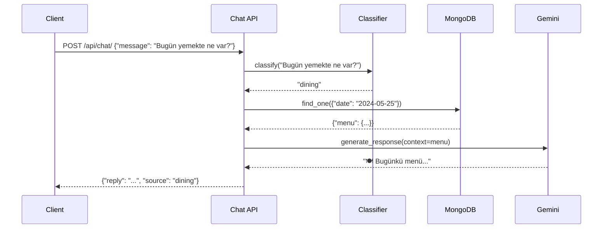

## Overview

The Chat API is the **primary endpoint** for conversational interactions with the Akdeniz CSE AI Assistant. It:
1. Classifies user intent (dining, announcement, general)
2. Retrieves relevant context from the database
3. Generates natural language responses using Gemini

<Info>
This endpoint powers the WhatsApp bot for student interactions.
</Info>

## Endpoint

```
POST /api/chat/
```

## Request

### Headers

| Header | Value | Required |
|--------|-------|----------|
| `Content-Type` | `application/json` | ✅ Yes |

### Body Parameters

<ParamField body="message" type="string" required>
  The user's message or query in Turkish or English.
  
  **Examples:**
  - `"Bugün yemekte ne var?"`
  - `"Son duyurular neler?"`
  - `"Merhaba nasılsın?"`
</ParamField>

<ParamField body="user_id" type="string">
  Optional user identifier for tracking conversations.
  
  **Examples:**
  - `"user_12345"`
  - `"whatsapp:+905551234567"`
  - `null` (anonymous)
</ParamField>

### Request Schema

```json
{
  "message": "string",
  "user_id": "string | null"
}
```

### Example Requests

<CodeGroup>

```json Dining Query
{
  "message": "Bugün yemekte ne var?",
  "user_id": "user_12345"
}
```

```json Announcement Query
{
  "message": "Yeni duyurular var mı?",
  "user_id": "user_67890"
}
```

```json General Query
{
  "message": "Merhaba, nasılsın?",
  "user_id": null
}
```

```json English Query
{
  "message": "What's for lunch today?",
  "user_id": "user_11111"
}
```

</CodeGroup>

## Response

### Response Schema

```json
{
  "reply": "string",
  "source": "dining | announcement | general"
}
```

<ResponseField name="reply" type="string">
  The AI-generated response text, formatted with emojis and Markdown.
</ResponseField>

<ResponseField name="source" type="string">
  The classified intent of the user's message:
  - `"dining"` - Question about food/menus
  - `"announcement"` - Question about announcements
  - `"general"` - General conversation
</ResponseField>

### Example Responses

<CodeGroup>

```json Dining Response
{
  "reply": "🍽️ **Bugünkü Menü (25 Mayıs 2024)**\n\n**Çorba:**\n• Mercimek Çorbası\n\n**Ana Yemek:**\n• Tavuk Şinitzel\n• Pilav\n• Makarna\n\n**Yan Ürünler:**\n• Salata\n• Ayran\n• Meyve",
  "source": "dining"
}
```

```json Announcement Response
{
  "reply": "📢 **Son Duyurular:**\n\n1. **Final Sınavı Tarihleri Açıklandı**\n   📅 Tarih: 15 Haziran 2024\n   📝 Detaylar: Öğrenci bilgi sisteminde yayınlandı.\n\n2. **Mezuniyet Töreni**\n   📅 Tarih: 30 Haziran 2024\n   📍 Yer: Merkez Kampüs Konferans Salonu\n\nDaha fazla bilgi için bölüm web sitesini ziyaret edin.",
  "source": "announcement"
}
```

```json General Response
{
  "reply": "Merhaba! 👋 Ben Akdeniz Üniversitesi Bilgisayar Mühendisliği AI Asistanıyım. Size nasıl yardımcı olabilirim?\n\n• Yemek menüsü sorabilirsiniz 🍽️\n• Duyuruları öğrenebilirsiniz 📢\n• Genel sorularınızı yanıtlayabilirim 💬",
  "source": "general"
}
```

</CodeGroup>

## HTTP Status Codes

| Status Code | Description |
|-------------|-------------|
| **200 OK** | Request processed successfully |
| **400 Bad Request** | Invalid request body (e.g., missing `message` field) |
| **422 Unprocessable Entity** | Request validation failed (Pydantic error) |
| **500 Internal Server Error** | Server error (e.g., database connection failed) |
| **503 Service Unavailable** | Gemini API unavailable or rate limited |

## Error Responses

### 400 Bad Request

```json
{
  "detail": "Message field is required"
}
```

### 422 Validation Error

```json
{
  "detail": [
    {
      "type": "missing",
      "loc": ["body", "message"],
      "msg": "Field required",
      "input": {}
    }
  ]
}
```

### 500 Internal Server Error

```json
{
  "detail": "Failed to connect to database"
}
```

## Request Flow

<Steps>
  <Step title="Client Sends Request">
    WhatsApp bot sends POST request with user message
  </Step>
  <Step title="Input Validation">
    FastAPI validates request body against `ChatRequest` schema
  </Step>
  <Step title="Intent Classification">
    Classifier (Ollama/Fuzzy/Hybrid) determines intent of message
  </Step>
  <Step title="Context Retrieval">
    Backend queries MongoDB for relevant data based on intent
  </Step>
  <Step title="Response Generation">
    Gemini generates natural language response using context
  </Step>
  <Step title="Response Delivery">
    FastAPI returns JSON response to client
  </Step>
</Steps>

## Sequence Diagram



## Code Example

### cURL

```bash
curl -X POST "http://localhost:8000/api/chat/" \
  -H "Content-Type: application/json" \
  -d '{
    "message": "Bugün yemekte ne var?",
    "user_id": "user_12345"
  }'
```

### Python (requests)

```python
import requests

response = requests.post(
    "http://localhost:8000/api/chat/",
    json={
        "message": "Bugün yemekte ne var?",
        "user_id": "user_12345"
    }
)

data = response.json()
print(f"Reply: {data['reply']}")
print(f"Source: {data['source']}")
```

### JavaScript (fetch)

```javascript
const response = await fetch('http://localhost:8000/api/chat/', {
  method: 'POST',
  headers: {
    'Content-Type': 'application/json',
  },
  body: JSON.stringify({
    message: 'Bugün yemekte ne var?',
    user_id: 'user_12345',
  }),
});

const data = await response.json();
console.log('Reply:', data.reply);
console.log('Source:', data.source);
```

### React Native

```typescript
import axios from 'axios';

const sendMessage = async (message: string) => {
  try {
    const response = await axios.post('http://localhost:8000/api/chat/', {
      message,
      user_id: 'user_12345',
    });
    
    console.log('Reply:', response.data.reply);
    console.log('Source:', response.data.source);
    
    return response.data;
  } catch (error) {
    console.error('Error:', error);
    throw error;
  }
};

// Usage
await sendMessage('Bugün yemekte ne var?');
```

## Rate Limiting

<Warning>
**Gemini API has rate limits:**
- Free tier: 15 requests per minute
- Pro tier: 60 requests per minute

If rate limit is exceeded, the endpoint returns **503 Service Unavailable**.
</Warning>

### Rate Limit Headers (Future)

```http
X-RateLimit-Limit: 15
X-RateLimit-Remaining: 12
X-RateLimit-Reset: 1716633600
```

## Performance

| Metric | Value |
|--------|-------|
| **Average Latency** | 500-1000ms |
| **Classification Time** | 10-300ms (depends on strategy) |
| **Database Query** | 10-50ms |
| **Gemini Generation** | 400-800ms |
| **Max Throughput** | ~15 req/min (Gemini limit) |

<Tip>
Use **Hybrid classifier** for best performance - it falls back to fast fuzzy matching if Ollama times out.
</Tip>

## Best Practices

### 1. Handle Timeouts

```python
import requests
from requests.exceptions import Timeout

try:
    response = requests.post(
        "http://localhost:8000/api/chat/",
        json={"message": "Test"},
        timeout=10  # 10 second timeout
    )
except Timeout:
    print("Request timed out - try again")
```

### 2. Retry on 503

```python
import time
import requests

def chat_with_retry(message: str, max_retries: int = 3):
    for attempt in range(max_retries):
        response = requests.post(
            "http://localhost:8000/api/chat/",
            json={"message": message}
        )
        
        if response.status_code == 503:
            # Rate limited - wait and retry
            time.sleep(2 ** attempt)  # Exponential backoff
            continue
        
        return response.json()
    
    raise Exception("Max retries exceeded")
```

### 3. User ID Tracking

```python
import uuid

# Generate unique user ID per session
user_id = str(uuid.uuid4())

# Include in all requests for conversation tracking
response = requests.post(
    "http://localhost:8000/api/chat/",
    json={
        "message": "Merhaba",
        "user_id": user_id
    }
)
```

## Troubleshooting

<AccordionGroup>
  <Accordion title="Error: 'Message field is required'">
    **Cause:** Request body missing `message` field
    
    **Solution:**
    ```json
    {
      "message": "Your message here"  // ✅ Required
    }
    ```
  </Accordion>

  <Accordion title="Error: 503 Service Unavailable">
    **Cause:** Gemini API rate limit exceeded
    
    **Solution:**
    - Wait 60 seconds before retrying
    - Implement exponential backoff
    - Consider upgrading to Gemini Pro tier
  </Accordion>

  <Accordion title="Response is empty or generic">
    **Cause:** Database has no relevant data
    
    **Solution:**
    - Run data pipeline to populate database
    - Check MongoDB connection
    - Verify collection names match configuration
  </Accordion>

  <Accordion title="Slow response time (>3 seconds)">
    **Cause:** Ollama classifier timing out
    
    **Solution:**
    - Switch to `CLASSIFICATION_METHOD=fuzzy` for faster classification
    - Or use `CLASSIFICATION_METHOD=hybrid` with lower timeout
    ```env
    CLASSIFICATION_METHOD=hybrid
    OLLAMA_TIMEOUT=1.0  # Reduce from default 2.0
    ```
  </Accordion>
</AccordionGroup>

## Related Endpoints

<CardGroup cols={2}>
  <Card title="Dining API" icon="utensils" href="/api-reference/dining">
    Get specific menu by date
  </Card>
  <Card title="Announcements API" icon="bullhorn" href="/api-reference/announcements">
    Get latest announcements
  </Card>
  <Card title="Health Check" icon="heart-pulse" href="/api-reference/health">
    Check API status
  </Card>
  <Card title="WebSocket Chat" icon="messages" href="/api-reference/websocket">
    Real-time chat (future)
  </Card>
</CardGroup>

## Next Steps

- Learn about [Intent Classification](/backend/llm-engine) to understand how messages are processed
- Explore [Response Generation](/backend/prompts) to customize AI responses
- Integrate with [Mobile App](/mobile/setup) or [WhatsApp Bot](/whatsapp/setup)
