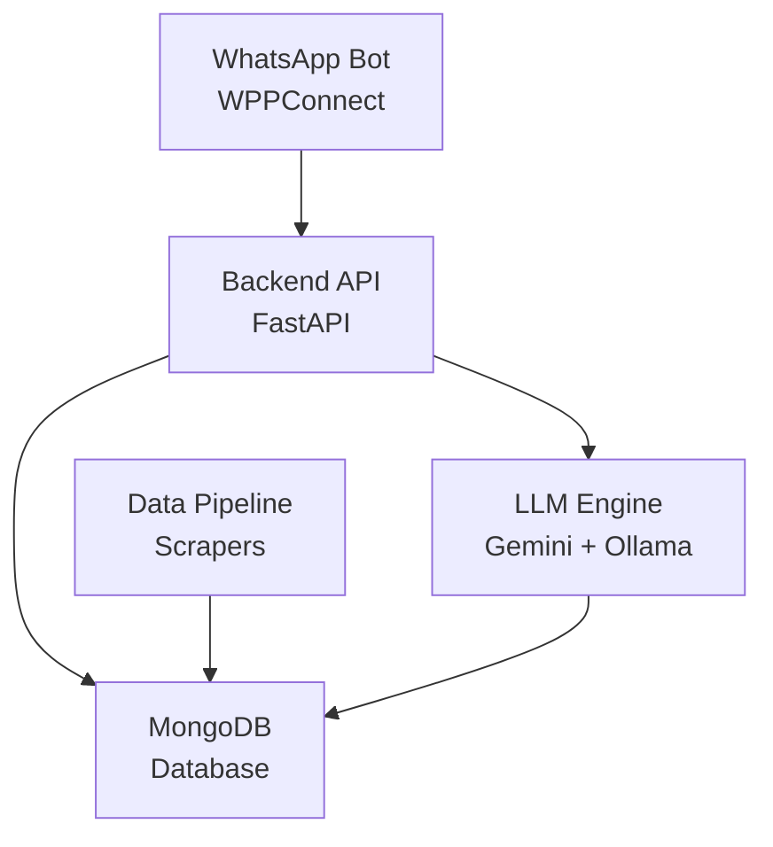
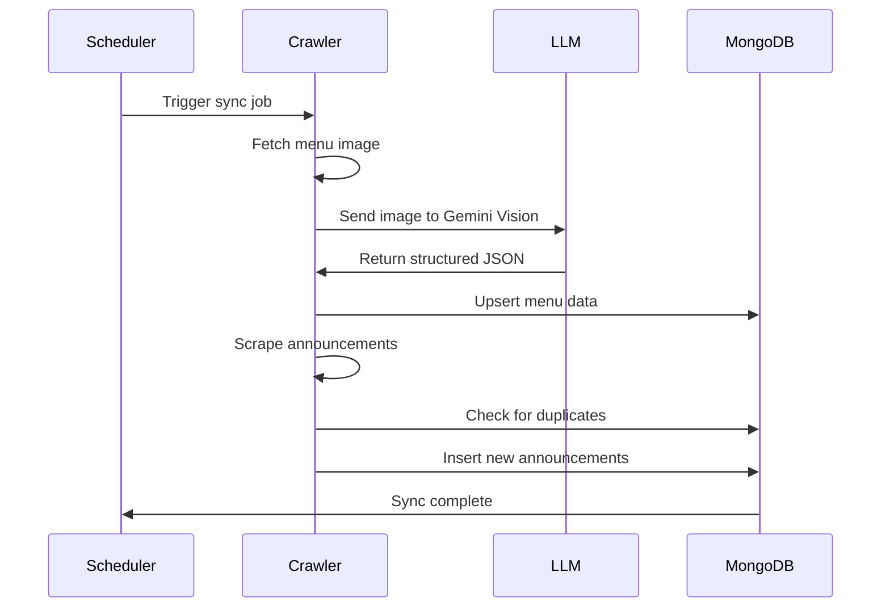

## System Overview

The Akdeniz CSE AI Assistant follows a **microservices-oriented architecture** designed for scalability, maintainability, and separation of concerns.



## Core Components

### 1. Backend API (FastAPI)

The central nervous system of the application.

<Card title="Key Responsibilities" icon="server">
- Request routing and validation
- Intent classification orchestration
- Database query management
- Response generation coordination
- API endpoint exposure
</Card>

**Technology Stack:**
- **Framework:** FastAPI (Python 3.10+)
- **Database Driver:** Motor (async MongoDB)
- **Validation:** Pydantic
- **Server:** Uvicorn

**Directory Structure:**
```
backend/
├── app/
│   ├── api/routes/          # API endpoints
│   ├── llm_engine/          # AI classification & generation
│   ├── core/                # Config & security
│   ├── db/                  # Database connections
│   └── models/              # Pydantic schemas
└── main.py                  # Application entry point
```

### 2. LLM Engine

Intelligent natural language processing subsystem.

<CardGroup cols={2}>
  <Card title="Intent Classification" icon="brain">
    - **Ollama (Qwen2:7b)** - Local, low-latency classification
    - **Fuzzy Matching** - Keyword-based fallback
    - **Hybrid Mode** - Best of both worlds
  </Card>
  <Card title="Response Generation" icon="sparkles">
    - **Gemini 2.5 Flash** - Advanced context-aware responses
    - **Prompt Engineering** - System instructions for personality
    - **Context Injection** - Database results in prompts
  </Card>
</CardGroup>

**Classification Flow:**

<Steps>
  <Step title="Receive User Message">
    Message arrives from WhatsApp bot
  </Step>
  <Step title="Strategy Selection">
    Factory pattern instantiates the configured classifier
  </Step>
  <Step title="Intent Detection">
    Classify as: **dining**, **announcement**, or **general**
  </Step>
  <Step title="Context Fetching">
    Query MongoDB for relevant data based on intent
  </Step>
  <Step title="Response Generation">
    Gemini generates natural language response with context
  </Step>
</Steps>

### 3. Data Pipeline

Automated data collection and processing system.

<Tabs>
  <Tab title="Visual Parser">
    **Dining Menu Crawler**
    - Scrapes SKS website for menu images
    - Uses Gemini Vision API for OCR
    - Converts images to structured JSON
    - Stores in MongoDB with date indexing
    
    ```python
    def extract_menu_from_image(image_bytes):
        image = preprocess_image(image_bytes)
        prompt = get_menu_prompt()
        raw_response = query_gemini(image, prompt)
        return parse_json_response(raw_response)
    ```
  </Tab>
  
  <Tab title="Web Scraper">
    **Announcement Crawler**
    - Scrapes CSE department website
    - Extracts titles, links, and dates
    - Filters duplicates using MongoDB queries
    - Schedules automatic syncs
    
    ```python
    def fetch_links():
        soup = BeautifulSoup(response.content)
        list_group = soup.find("div", class_="list-announcement")
        items = list_group.find_all("a", class_="list-group-item")
        return parse_announcements(items)
    ```
  </Tab>
  
  <Tab title="Scheduler">
    **Job Orchestration**
    - Runs every 30 minutes (configurable)
    - Syncs dining menus and announcements
    - Handles failures gracefully
    - Logs all operations
    
    ```python
    schedule.every(sync_interval).seconds.do(job_sync_all)
    while True:
        schedule.run_pending()
        time.sleep(1)
    ```
  </Tab>
</Tabs>

### 4. WhatsApp Bot

WhatsApp integration using WPPConnect for student access.

**Key Features:**
- 💬 **24/7 Availability** - Always-on WhatsApp bot
- 🔔 **Push Notifications** - Real-time updates via WhatsApp
- 👥 **Multi-User** - Handles concurrent conversations
- 🔒 **Session Management** - Persistent QR authentication

**Bot Architecture:**

<CardGroup cols={2}>
  <Card title="Message Handling" icon="message">
    - Listens to specified group
    - Saves all messages for context
    - Responds only when mentioned with @
    - Quotes original message in reply
  </Card>
  <Card title="Context Learning" icon="brain">
    - Stores conversation history in MongoDB
    - Provides context to backend API
    - Enables contextual understanding
    - Improves response accuracy
  </Card>
</CardGroup>

**Mention Detection Logic:**
```javascript
checkBotMention(message) {
  // Check mentionedJidList
  if (message.mentionedJidList.includes(botPhone)) return true;
  
  // Check text-based mentions
  if (/@905441188507/.test(message.body)) return true;
  
  // Check keyword mentions
  if (/csebot|aideniz/.test(message.body.toLowerCase())) return true;
  
  return false;
}
```

## Data Flow

### User Query Processing

<Steps>
  <Step title="1. User Input">
    User sends message: "Bugün yemekte ne var?"
  </Step>
  <Step title="2. Client to API">
    WhatsApp bot sends POST to `/api/chat/`
  </Step>
  <Step title="3. Intent Classification">
    Backend classifies intent as **dining** using Ollama
  </Step>
  <Step title="4. Context Retrieval">
    Backend queries MongoDB for today's menu
  </Step>
  <Step title="5. Response Generation">
    Gemini generates natural response with menu data
  </Step>
  <Step title="6. Delivery">
    Response sent back to client and displayed to user
  </Step>
</Steps>

### Data Synchronization Flow



## Database Schema

### Collections

<Accordion title="yemekhane_listesi (Dining Menus)">
```json
{
  "date": "2025-12-06",
  "day": "Cuma",
  "soup": "Mercimek çorbası",
  "main_dish": "Tavuk sote",
  "side_dish": "Pilav",
  "other": "Ayran",
  "calories": 850,
  "location": "Yemekhane",
  "created_at": "2025-12-06T08:00:00Z"
}
```
</Accordion>

<Accordion title="cse_akdeniz_announcements">
```json
{
  "_id": ObjectId("..."),
  "title": "Final Sınav Tarihleri Açıklandı",
  "link": "https://cse.akdeniz.edu.tr/tr/duyuru/...",
  "content": "Final sınavları 13-24 Ocak tarihleri arasında...",
  "source_type": "website",
  "created_at": "2025-12-06T10:30:00Z",
  "scraped_at": "2025-12-06T10:30:00Z"
}
```
</Accordion>

<Accordion title="messages (WhatsApp Logs)">
```json
{
  "messageId": "3EB0ABC123...",
  "from": {
    "number": "905441188507",
    "name": "Egemen",
    "isMe": false
  },
  "group": {
    "id": "120363...",
    "name": "CSE BOT"
  },
  "content": {
    "type": "text",
    "text": "Bugün yemekte ne var?",
    "caption": null
  },
  "timestamp": "2025-12-06T10:30:00Z",
  "processed": true,
  "response": {
    "text": "Bugün menüde...",
    "timestamp": "2025-12-06T10:30:05Z",
    "success": true
  }
}
```
</Accordion>

## Scalability Considerations

<CardGroup cols={2}>
  <Card title="Horizontal Scaling" icon="arrows-left-right">
    - FastAPI supports multiple workers
    - MongoDB sharding for large datasets
    - Load balancer for API distribution
  </Card>
  <Card title="Caching Strategy" icon="database">
    - Redis for frequently accessed data
    - In-memory LRU cache for menus
    - CDN for static assets
  </Card>
  <Card title="Async Processing" icon="clock">
    - Motor for non-blocking DB queries
    - Background tasks for long operations
    - Message queue for WhatsApp responses
  </Card>
  <Card title="Rate Limiting" icon="gauge-high">
    - API rate limiting per client
    - LLM request throttling
    - WhatsApp message quotas
  </Card>
</CardGroup>

## Security Architecture

<Warning>
**Important:** Never commit sensitive credentials to Git. Use `.env` files and environment variables.
</Warning>

**Security Measures:**
- Environment-based configuration
- MongoDB connection string encryption
- API key rotation support
- Input sanitization and validation
- CORS policy enforcement

## Next Steps

<CardGroup cols={2}>
  <Card title="Backend Deep Dive" icon="server" href="/backend/overview">
    Explore the FastAPI implementation
  </Card>
  <Card title="Design Patterns" icon="puzzle-piece" href="/patterns/overview">
    Learn about the patterns used
  </Card>
</CardGroup>
