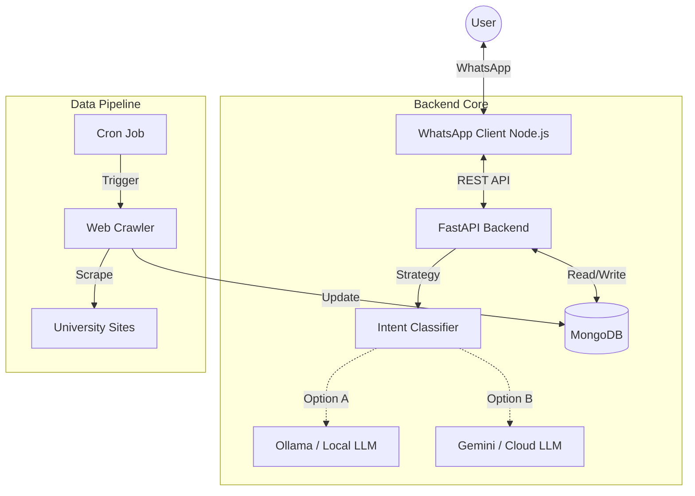
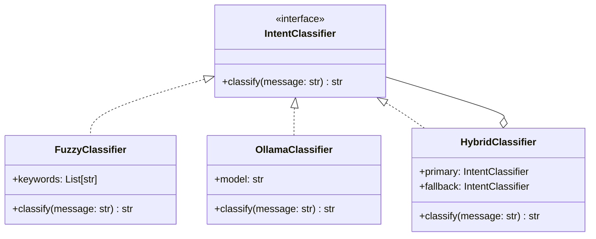

## System Overview

The project consists of three main independent subsystems communicating via APIs and a shared database.

1.  **Backend API (FastAPI)**: The brain of the operation. Handles logic, database access, and AI processing.
2.  **WhatsApp Client (Node.js)**: A bridge that listens to WhatsApp messages and forwards them to the backend.
3.  **Data Pipeline (Python)**: Background scheduled jobs that scrape websites (SKS, CSE) and update the database.

## Architecture Diagram

## Class Diagram (Simplified)

This diagram illustrates the **Strategy Pattern** used for classification.

## Data Flow (Chat)

1.  **User** sends message to WhatsApp Group.
2.  **WhatsApp Client** listens, filters for target group, and POSTs payload to `/api/chat`.
3.  **FastAPI** receives request.
4.  **Classifier** determines if user wants "Food", "Announcements", or "Chat".
5.  **Service Layer** fetches relevant context (e.g., today's menu) from MongoDB.
6.  **LLM Engine** constructs a prompt with Context + History + User Query.
7.  **Response** is generated and sent back to WhatsApp Client.
8.  **WhatsApp Client** replies to the user.
