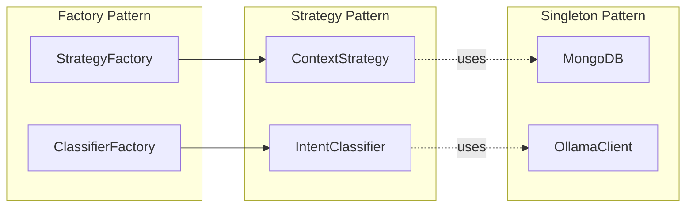
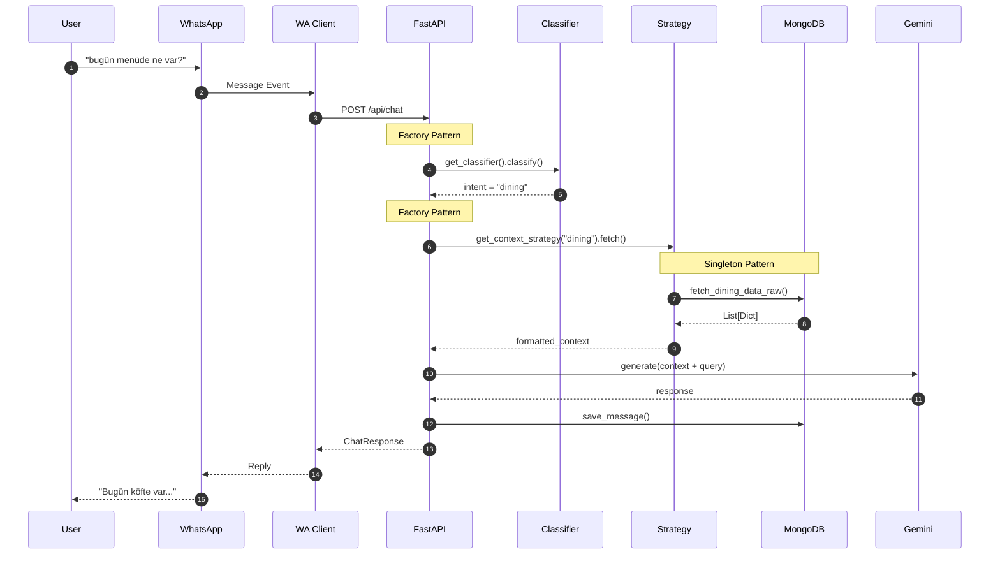
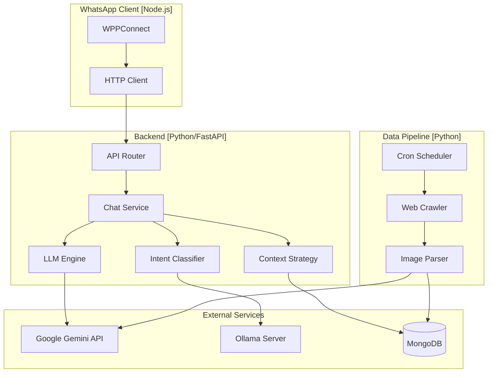

## System Overview

ChatbotForCse consists of **three independent subsystems** communicating via REST APIs and a shared MongoDB database.

<Tabs>
  <Tab title="System Diagram" icon="diagram-project">
    ```mermaid
    graph TD
        subgraph "External Interfaces"
            User((User))
            WA[WhatsApp]
            SKS[SKS Website]
            CSE[CSE Website]
        end
        
        subgraph "Core System"
            WAClient[WhatsApp Client<br/>Node.js]
            API[FastAPI Backend]
            Pipeline[Data Pipeline<br/>Python]
        end
        
        subgraph "AI/ML"
            Gemini[Google Gemini]
            Ollama[Ollama/Qwen]
        end
        
        DB[(MongoDB)]
        
        User <-->|Messages| WA
        WA <-->|WPPConnect| WAClient
        WAClient <-->|REST API| API
        
        API <-->|Intent Classification| Ollama
        API <-->|Response Generation| Gemini
        API <-->|CRUD| DB
        
        Pipeline -->|Scrape| SKS
        Pipeline -->|Scrape| CSE
        Pipeline -->|Update| DB
    ```
  </Tab>
  <Tab title="Components" icon="puzzle-piece">
    <CardGroup cols={3}>
      <Card title="Backend API" icon="server" color="#3B82F6">
        FastAPI handles logic, database access, and AI processing
      </Card>
      <Card title="WhatsApp Client" icon="whatsapp" color="#25D366">
        Node.js bridge listening to WhatsApp messages
      </Card>
      <Card title="Data Pipeline" icon="arrows-rotate" color="#F59E0B">
        Python scheduled jobs for web scraping
      </Card>
    </CardGroup>
  </Tab>
</Tabs>

---

## Layered Architecture

The backend follows a clean **4-layer architecture**:

<Tabs>
  <Tab title="Layer Diagram" icon="layer-group">
    ```mermaid
    graph TB
        subgraph "API Layer"
            A1["/api/chat"]
            A2["/api/dining"]
        end
        
        subgraph "Service Layer"
            S1[chat_service.py]
            S2[dining_service.py]
        end
        
        subgraph "Domain Layer"
            D1[IntentClassifier<br/>Strategy Pattern]
            D2[ContextStrategy<br/>Strategy Pattern]
            D3[LLM Engine]
        end
        
        subgraph "Data Access Layer"
            DA1[MongoDB Singleton]
            DA2[OllamaClient Singleton]
        end
        
        A1 --> S1
        A2 --> S2
        S1 --> D1
        S1 --> D2
        S1 --> D3
        D1 --> DA2
        D2 --> DA1
        D3 --> DA1
    ```
  </Tab>
  <Tab title="Responsibilities" icon="list-check">
    | Layer | Responsibility | Key Files |
    |-------|----------------|-----------|
    | **API** | HTTP endpoints | `api/routes/chat.py` |
    | **Service** | Business logic | `services/chat_service.py` |
    | **Domain** | Core algorithms | `llm_engine/`, `strategies/` |
    | **Data Access** | Database ops | `db/mongo.py`, `clients/` |
  </Tab>
</Tabs>

---

## Design Pattern Locations

<CardGroup cols={3}>
  <Card title="Strategy Pattern" icon="arrows-split-up-and-left" color="#10B981">
    **Files:**
    - `llm_engine/classifiers/`
    - `strategies/context_strategies.py`
  </Card>
  <Card title="Factory Pattern" icon="industry" color="#3B82F6">
    **Files:**
    - `llm_engine/classifier.py`
    - `strategies/context_strategies.py`
  </Card>
  <Card title="Singleton Pattern" icon="database" color="#8B5CF6">
    **Files:**
    - `db/mongo.py`
    - `clients/ollama_client.py`
  </Card>
</CardGroup>



---

## Chat Request Flow

<Steps>
  <Step title="User Message" icon="message">
    User sends "bugün menüde ne var?" via WhatsApp
  </Step>
  <Step title="Message Forwarding" icon="arrow-right">
    WhatsApp Client forwards to FastAPI backend
  </Step>
  <Step title="Intent Classification" icon="brain">
    Factory returns HybridClassifier → classifies as "dining"
  </Step>
  <Step title="Context Fetching" icon="database">
    Factory returns DiningStrategy → fetches menu from MongoDB
  </Step>
  <Step title="LLM Response" icon="robot">
    Gemini generates natural language response
  </Step>
  <Step title="Reply" icon="reply">
    Response sent back to WhatsApp user
  </Step>
</Steps>

### Sequence Diagram

<Accordion title="View Full Sequence Diagram" icon="diagram-project">

</Accordion>

---

## Directory Structure

<Accordion title="Full Project Structure" icon="folder-tree" defaultOpen>
```
ChatbotForCse/
├── backend/
│   ├── app/
│   │   ├── api/routes/           # API endpoints
│   │   ├── core/                 # Settings & config
│   │   ├── db/                   # MongoDB Singleton
│   │   ├── llm_engine/
│   │   │   ├── classifiers/      # Strategy Pattern
│   │   │   └── clients/          # Singleton clients
│   │   ├── services/             # Business logic
│   │   └── strategies/           # Context Strategy Pattern
│   └── main.py
├── data-pipeline/
│   ├── crawlers/                 # SKS/CSE scrapers
│   ├── jobs/                     # Scheduled tasks
│   └── services/                 # Image processing
├── whatsapp/
│   └── src/                      # Node.js WPPConnect
└── documentation/                # Mintlify docs
```
</Accordion>

---

## Component Diagram

<Accordion title="View Component Diagram" icon="puzzle-piece">

</Accordion>
