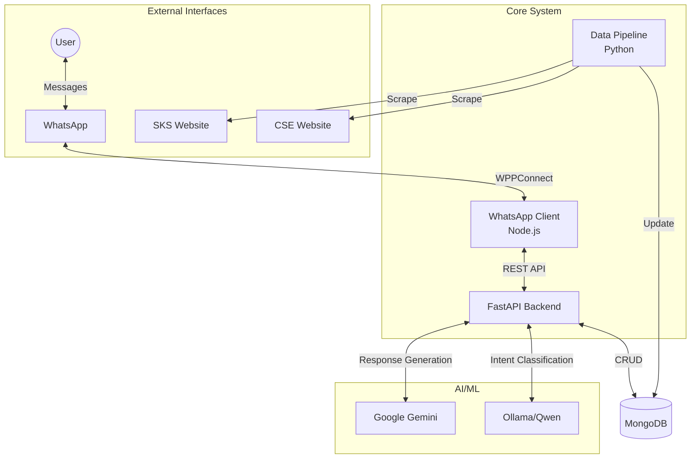
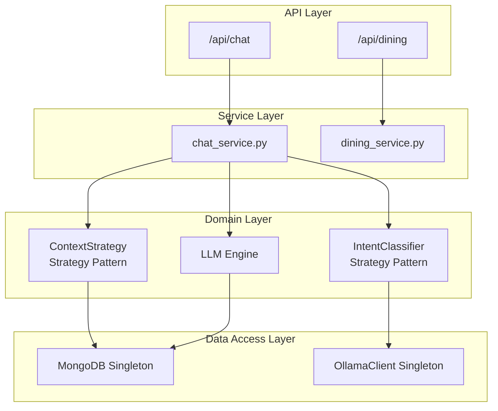
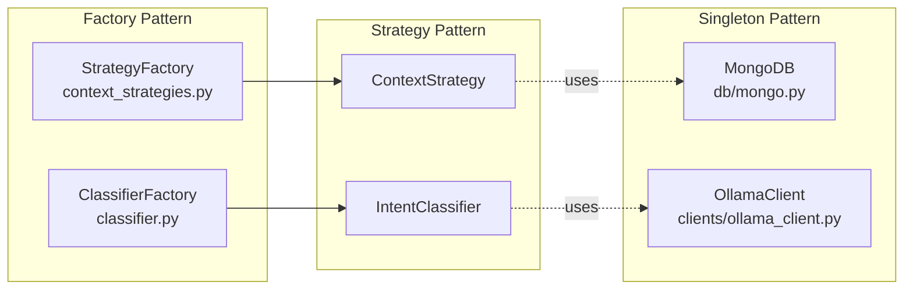
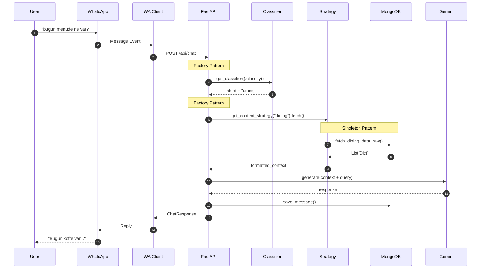
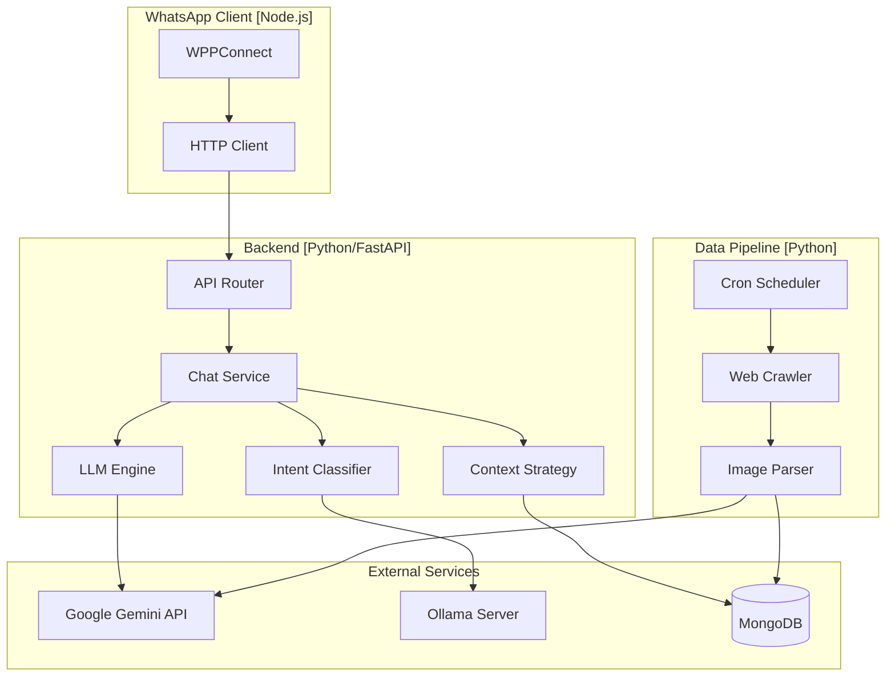

## System Overview

ChatbotForCse consists of **three independent subsystems** communicating via REST APIs and a shared MongoDB database.



---

## Layered Architecture

The backend follows a clean **4-layer architecture**:



| Layer | Responsibility | Files |
|-------|----------------|-------|
| **API** | HTTP endpoints, request/response | `api/routes/chat.py` |
| **Service** | Business logic orchestration | `services/chat_service.py` |
| **Domain** | Core algorithms, AI logic | `llm_engine/`, `strategies/` |
| **Data Access** | Database, external clients | `db/mongo.py`, `clients/` |

---

## Design Pattern Locations



---

## Chat Request Data Flow

Detailed sequence of a chat request through the system:



---

## Component Diagram



---

## Directory Structure

```
ChatbotForCse/
├── backend/
│   ├── app/
│   │   ├── api/routes/           # API endpoints
│   │   ├── core/                 # Settings & config
│   │   ├── db/                   # MongoDB Singleton
│   │   ├── llm_engine/
│   │   │   ├── classifiers/      # Strategy Pattern
│   │   │   └── clients/          # Singleton clients
│   │   ├── services/             # Business logic
│   │   └── strategies/           # Context Strategy Pattern
│   └── main.py
├── data-pipeline/
│   ├── crawlers/                 # SKS/CSE scrapers
│   ├── jobs/                     # Scheduled tasks
│   └── services/                 # Image processing
├── whatsapp/
│   └── src/                      # Node.js WPPConnect
└── documentation/                # Mintlify docs
```
