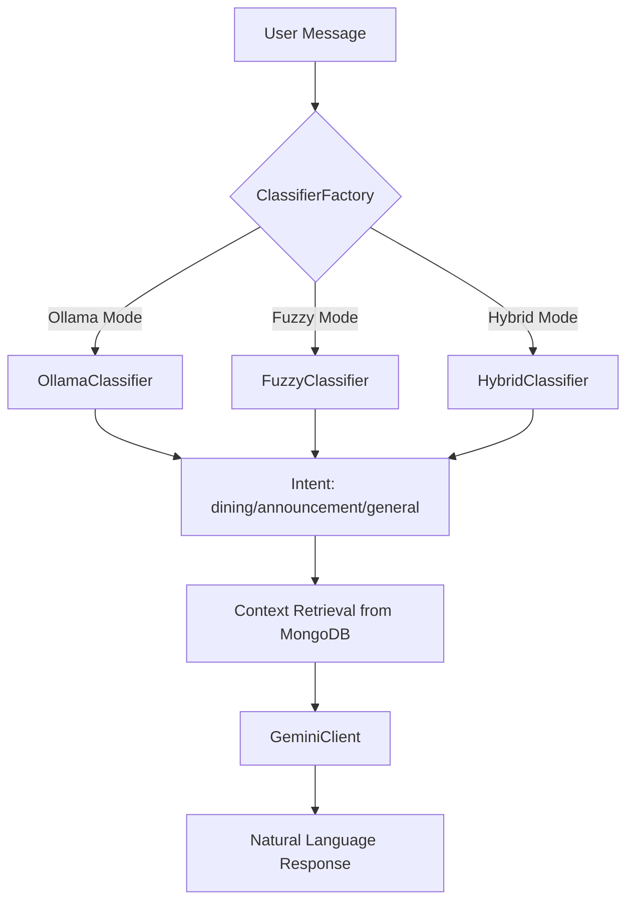

## Overview

The LLM Engine is the **brain** of the chatbot, responsible for:
1. **Intent Classification** - Understanding what the user wants
2. **Response Generation** - Crafting natural language responses with context

## Architecture



## Components

### 1. Classifier Interface (`classifier.py`)

Abstract base class defining the classification contract.

```python
from abc import ABC, abstractmethod

class Classifier(ABC):
    @abstractmethod
    async def classify(self, user_message: str) -> str:
        """
        Classify the intent of the user message.
        
        Returns:
            "dining" | "announcement" | "general"
        """
        pass
```

<Info>
This follows the **Strategy Pattern** - allowing different classification algorithms to be swapped at runtime.
</Info>

### 2. Ollama Classifier (`classifiers/ollama_classifier.py`)

Uses local Ollama LLM (Qwen2:7b) for intelligent intent classification.

```python
class OllamaClassifier(Classifier):
    def __init__(
        self,
        base_url: str = "http://localhost:11434",
        model: str = "qwen2:7b",
        temperature: float = 0.3
    ):
        self.client = OllamaClient(base_url=base_url)
        self.model = model
        self.temperature = temperature
    
    async def classify(self, user_message: str) -> str:
        prompt = f"""Classify this Turkish message into one of these categories:
- "dining" for food/menu questions (yemek, menü, yemekhane)
- "announcement" for announcements (duyuru, haber)
- "general" for anything else

Message: "{user_message}"

Respond with ONLY one word: dining, announcement, or general."""

        response = await self.client.chat_completion(
            model=self.model,
            messages=[{"role": "user", "content": prompt}],
            temperature=self.temperature
        )
        
        intent = response["message"]["content"].strip().lower()
        
        if intent in ["dining", "announcement", "general"]:
            return intent
        return "general"
```

**Advantages:**
- ✅ **Intelligent context understanding** - Handles synonyms, misspellings
- ✅ **Turkish language support** - Native understanding of Turkish queries
- ✅ **Privacy-first** - Runs locally, no data sent to cloud

**Disadvantages:**
- ❌ **Requires Ollama installation** - Extra setup step
- ❌ **Slower than fuzzy matching** - ~200-500ms per request
- ❌ **Resource intensive** - Uses CPU/GPU for inference

### 3. Fuzzy Classifier (`classifiers/fuzzy_classifier.py`)

Lightweight keyword-based classification using FuzzyWuzzy.

```python
class FuzzyClassifier(Classifier):
    def __init__(self, threshold: int = 70):
        self.threshold = threshold
        
        # Keyword lists for each intent
        self.dining_keywords = [
            "yemek", "menü", "yemekhane", "öğle yemeği", 
            "akşam yemeği", "çorba", "yemekler", "ne yiyeceğiz"
        ]
        
        self.announcement_keywords = [
            "duyuru", "haber", "ilan", "duyurular", 
            "haberler", "bilgi", "açıklama"
        ]
    
    async def classify(self, user_message: str) -> str:
        message_lower = user_message.lower()
        
        # Calculate similarity scores
        dining_score = max(
            fuzz.partial_ratio(message_lower, kw) 
            for kw in self.dining_keywords
        )
        
        announcement_score = max(
            fuzz.partial_ratio(message_lower, kw)
            for kw in self.announcement_keywords
        )
        
        # Return highest scoring intent above threshold
        if dining_score > self.threshold and dining_score > announcement_score:
            return "dining"
        elif announcement_score > self.threshold:
            return "announcement"
        else:
            return "general"
```

**Advantages:**
- ✅ **Extremely fast** - Less than 10ms per request
- ✅ **No dependencies** - Works without Ollama or external services
- ✅ **Predictable** - Same input always gives same output

**Disadvantages:**
- ❌ **Limited understanding** - Only matches keywords
- ❌ **No context awareness** - Can't handle complex queries
- ❌ **Requires manual keyword updates** - Not self-improving

### 4. Hybrid Classifier (`classifiers/hybrid_classifier.py`)

**Best of both worlds** - combines Ollama intelligence with Fuzzy fallback.

```python
class HybridClassifier(Classifier):
    def __init__(
        self,
        ollama_base_url: str = "http://localhost:11434",
        ollama_model: str = "qwen2:7b",
        fuzzy_threshold: int = 70,
        ollama_timeout: float = 2.0
    ):
        self.ollama_classifier = OllamaClassifier(
            base_url=ollama_base_url,
            model=ollama_model
        )
        self.fuzzy_classifier = FuzzyClassifier(threshold=fuzzy_threshold)
        self.timeout = ollama_timeout
    
    async def classify(self, user_message: str) -> str:
        try:
            # Try Ollama with timeout
            result = await asyncio.wait_for(
                self.ollama_classifier.classify(user_message),
                timeout=self.timeout
            )
            return result
            
        except (asyncio.TimeoutError, Exception) as e:
            logger.warning(f"Ollama failed, using fuzzy: {e}")
            
            # Fallback to fuzzy matching
            return await self.fuzzy_classifier.classify(user_message)
```

**When to Use:**
- ✅ **Production deployments** - Reliability is critical
- ✅ **Unreliable network** - Ollama may timeout
- ✅ **Resource constraints** - Ollama may crash under load

<Tip>
The Hybrid strategy is **recommended for production** as it provides the best user experience with guaranteed uptime.
</Tip>

### 5. Classifier Factory (`classifier.py`)

Implements the **Factory Pattern** to instantiate the correct classifier.

```python
def get_classifier_instance(settings: Settings) -> Classifier:
    """
    Factory function to create a classifier instance
    based on configuration.
    """
    method = settings.CLASSIFICATION_METHOD
    
    if method == "ollama":
        return OllamaClassifier(
            base_url=settings.OLLAMA_BASE_URL,
            model=settings.OLLAMA_MODEL,
            temperature=settings.OLLAMA_TEMPERATURE
        )
    
    elif method == "fuzzy":
        return FuzzyClassifier(
            threshold=settings.FUZZY_THRESHOLD
        )
    
    elif method == "hybrid":
        return HybridClassifier(
            ollama_base_url=settings.OLLAMA_BASE_URL,
            ollama_model=settings.OLLAMA_MODEL,
            fuzzy_threshold=settings.FUZZY_THRESHOLD,
            ollama_timeout=settings.OLLAMA_TIMEOUT
        )
    
    else:
        raise ValueError(f"Unknown classification method: {method}")
```

**Usage in Routes:**
```python
from app.llm_engine.classifier import get_classifier_instance
from app.core.config import settings

classifier = get_classifier_instance(settings)

@router.post("/chat/")
async def chat_endpoint(request: ChatRequest):
    intent = await classifier.classify(request.message)
    # ... rest of logic
```

## Response Generation

### Gemini Client (`gemini_client.py`)

Wrapper for Google's Gemini API with async support.

```python
class GeminiClient:
    def __init__(self, api_key: str, model: str = "gemini-2.0-flash-exp"):
        genai.configure(api_key=api_key)
        self.model = genai.GenerativeModel(model)
    
    async def generate_response(
        self,
        system_instruction: str,
        user_query: str,
        context_data: str
    ) -> str:
        """
        Generate a natural language response.
        
        Args:
            system_instruction: Role and behavior instructions
            user_query: User's original message
            context_data: Retrieved context (menu, announcements, etc.)
        
        Returns:
            Generated response text
        """
        full_prompt = f"""{system_instruction}

Context/Data:
{context_data}

User Query:
{user_query}

Response:"""

        response = await self.model.generate_content_async(full_prompt)
        return response.text
```

### System Instruction

Located in `app/llm_engine/prompts/system_prompt.py`:

```python
SYSTEM_INSTRUCTION = """Sen Akdeniz Üniversitesi Bilgisayar Mühendisliği 
öğrencilerine yardımcı olan yapay zeka destekli bir asistansın.

Görevlerin:
1. Yemek menüsü sorularını yanıtlamak
2. Bölüm duyurularını paylaşmak
3. Genel sorulara yardımcı olmak

Kurallar:
- Türkçe yanıt ver
- Nazik ve profesyonel ol
- Emoji kullan (🍽️ yemek için, 📢 duyuru için)
- Verilen context dışında bilgi uydurma
- Kısa ve öz yanıtlar ver
"""
```

## Testing Classification

### Interactive Test Script

```bash
python backend/test_classifier.py interactive
```

**Example Session:**
```
Classification Testing Tool
===========================
Configuration:
- Method: hybrid
- Ollama URL: http://localhost:11434
- Model: qwen2:7b

Enter message (or 'quit' to exit): Bugün yemekte ne var?
✓ Intent: dining (125ms)

Enter message (or 'quit' to exit): Yeni duyurular var mı?
✓ Intent: announcement (98ms)

Enter message (or 'quit' to exit): Merhaba nasılsın?
✓ Intent: general (105ms)
```

### Unit Tests

Create `tests/test_classifier.py`:

```python
import pytest
from app.llm_engine.classifiers import (
    OllamaClassifier,
    FuzzyClassifier,
    HybridClassifier
)

@pytest.mark.asyncio
async def test_fuzzy_dining():
    classifier = FuzzyClassifier(threshold=70)
    result = await classifier.classify("Bugün yemekte ne var?")
    assert result == "dining"

@pytest.mark.asyncio
async def test_fuzzy_announcement():
    classifier = FuzzyClassifier(threshold=70)
    result = await classifier.classify("Yeni duyurular var mı?")
    assert result == "announcement"

@pytest.mark.asyncio
async def test_fuzzy_general():
    classifier = FuzzyClassifier(threshold=70)
    result = await classifier.classify("Merhaba nasılsın?")
    assert result == "general"
```

Run tests:
```bash
pytest tests/test_classifier.py -v
```

## Performance Comparison

| Classifier | Avg Latency | Accuracy | Setup Required | Fallback |
|-----------|-------------|----------|----------------|----------|
| **Ollama** | 200-500ms | 95%+ | Yes (Ollama) | No |
| **Fuzzy** | Less than 10ms | 70-80% | No | N/A |
| **Hybrid** | 200-500ms* | 95%+ | Yes (Ollama) | Yes (Fuzzy) |

*Hybrid: Falls back to less than 10ms if Ollama fails

<Warning>
Ollama requires significant system resources:
- **RAM:** 4GB+ for Qwen2:7b model
- **Storage:** 5GB+ for model weights
- **CPU/GPU:** Better performance with GPU
</Warning>

## Configuration Best Practices

### Development
```env
CLASSIFICATION_METHOD=hybrid
OLLAMA_BASE_URL=http://localhost:11434
OLLAMA_MODEL=qwen2:7b
OLLAMA_TEMPERATURE=0.3
OLLAMA_TIMEOUT=2.0
FUZZY_THRESHOLD=70
```

### Production (Ollama Available)
```env
CLASSIFICATION_METHOD=hybrid
OLLAMA_BASE_URL=http://ollama-server:11434
OLLAMA_MODEL=qwen2:7b
OLLAMA_TIMEOUT=3.0
FUZZY_THRESHOLD=75
```

### Production (No Ollama)
```env
CLASSIFICATION_METHOD=fuzzy
FUZZY_THRESHOLD=65
```

## Next Steps

<CardGroup cols={2}>
  <Card title="Strategy Pattern" icon="chess" href="/patterns/strategy">
    Learn how Strategy Pattern enables swappable classifiers
  </Card>
  <Card title="API Routes" icon="route" href="/backend/api-routes">
    See how classifiers are used in endpoints
  </Card>
  <Card title="Prompts" icon="message" href="/backend/prompts">
    Understand prompt engineering techniques
  </Card>
  <Card title="Testing" icon="flask" href="/backend/testing">
    Write comprehensive tests for classifiers
  </Card>
</CardGroup>
