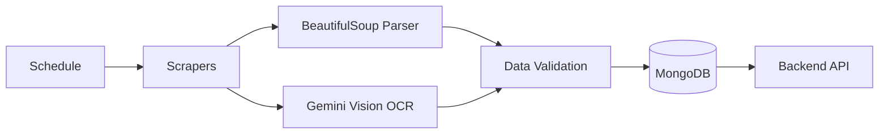

## Introduction

The **Data Pipeline** is responsible for automatically collecting, parsing, and storing information from Akdeniz University's websites into MongoDB.

<CardGroup cols={3}>
  <Card title="Dining Menus" icon="utensils">
    Daily menu scraper
  </Card>
  <Card title="Announcements" icon="bullhorn">
    Department news crawler
  </Card>
  <Card title="Visual Parsing" icon="image">
    Gemini Vision for PDFs/images
  </Card>
</CardGroup>

## Architecture



## Components

### 1. **Web Scrapers**

Located in `data-pipeline/scrapers/`:

| File | Target | Method | Frequency |
|------|--------|--------|-----------|
| `yemekhane_scraper.py` | akdeniz.edu.tr/yemekhane | BeautifulSoup | Daily |
| `cse_announcements.py` | cse.akdeniz.edu.tr/duyurular | BeautifulSoup + Gemini Vision | Hourly |

### 2. **Scheduler**

Located in `data-pipeline/main.py`:

```python
import schedule
import time

# Run dining scraper daily at 08:00
schedule.every().day.at("08:00").do(scrape_dining_menu)

# Run announcements scraper every hour
schedule.every().hour.do(scrape_cse_announcements)

while True:
    schedule.run_pending()
    time.sleep(60)
```

### 3. **Data Models**

Pydantic schemas ensure data consistency:

```python
class DiningMenu(BaseModel):
    date: str  # "2024-05-25"
    soup: str
    main_courses: List[str]
    sides: List[str]
    created_at: datetime

class Announcement(BaseModel):
    title: str
    content: str
    url: str
    date: Optional[str]
    created_at: datetime
```

## Scraping Process

<Steps>
  <Step title="Fetch HTML">
    HTTP request to target website
  </Step>
  <Step title="Parse Content">
    BeautifulSoup extracts structured data
  </Step>
  <Step title="Visual Processing">
    Gemini Vision parses images/PDFs (if needed)
  </Step>
  <Step title="Data Validation">
    Pydantic validates data structure
  </Step>
  <Step title="Store in MongoDB">
    Insert or update document
  </Step>
</Steps>

## Gemini Vision for OCR

Many announcements are posted as **images or PDFs**. Gemini Vision extracts text:

```python
def extract_text_from_image(image_url: str) -> str:
    """Use Gemini Vision to extract text from image."""
    
    # Download image
    response = requests.get(image_url)
    image_bytes = response.content
    
    # Send to Gemini Vision
    result = gemini_vision_client.analyze_image(
        image_bytes=image_bytes,
        prompt="Extract all Turkish text from this image. Format as plain text."
    )
    
    return result.text
```

**Benefits:**
- ✅ Extracts text from announcement posters
- ✅ Parses PDF documents
- ✅ Handles handwritten text
- ✅ Maintains Turkish character support (ç, ğ, ı, ö, ş, ü)

## Database Collections

### `yemekhane_listesi`

```json
{
  "_id": ObjectId("..."),
  "date": "2024-05-25",
  "soup": "Mercimek Çorbası",
  "main_courses": ["Tavuk Şinitzel", "Pilav"],
  "sides": ["Salata", "Ayran"],
  "created_at": ISODate("2024-05-24T08:00:00Z")
}
```

### `cse_akdeniz_announcements`

```json
{
  "_id": ObjectId("..."),
  "title": "Final Sınavı Tarihleri",
  "content": "Final sınav tarihleri açıklandı...",
  "url": "https://cse.akdeniz.edu.tr/duyuru/123",
  "date": "2024-05-20",
  "created_at": ISODate("2024-05-20T14:30:00Z")
}
```

## Running the Pipeline

### Manual Execution

```bash
cd data-pipeline
python -m venv venv
venv\Scripts\activate  # Windows
pip install -r requirements.txt

# Run once
python main.py --once

# Run continuously with scheduler
python main.py
```

### Environment Variables

```env
MONGO_CONNECTION_STRING=mongodb://localhost:27017
MONGO_DB_NAME=chatbot_db
GEMINI_API_KEY=your_gemini_api_key_here
USER_AGENT=Mozilla/5.0 (compatible; AkdenizBot/1.0)
```

## Error Handling

```python
def scrape_with_retry(url: str, max_retries: int = 3):
    for attempt in range(max_retries):
        try:
            response = requests.get(url, timeout=10)
            response.raise_for_status()
            return response
            
        except requests.RequestException as e:
            logger.warning(f"Attempt {attempt+1} failed: {e}")
            
            if attempt < max_retries - 1:
                time.sleep(2 ** attempt)  # Exponential backoff
            else:
                logger.error(f"Failed after {max_retries} attempts")
                raise
```

## Monitoring

### Logs

```python
import logging

logging.basicConfig(
    level=logging.INFO,
    format='%(asctime)s - %(name)s - %(levelname)s - %(message)s',
    handlers=[
        logging.FileHandler('scraper.log'),
        logging.StreamHandler()
    ]
)

logger = logging.getLogger(__name__)

# Usage
logger.info("Starting dining menu scraper")
logger.warning("No menu found for today")
logger.error("Failed to connect to database")
```

### Health Checks

```python
def check_pipeline_health():
    """Verify pipeline is working correctly."""
    
    # Check if data is recent
    latest_menu = db["yemekhane_listesi"].find_one(sort=[("created_at", -1)])
    
    if not latest_menu:
        return {"status": "error", "message": "No menus in database"}
    
    age = datetime.now() - latest_menu["created_at"]
    
    if age > timedelta(days=2):
        return {"status": "warning", "message": f"Latest menu is {age.days} days old"}
    
    return {"status": "ok", "message": "Pipeline healthy"}
```

## Performance

| Metric | Value |
|--------|-------|
| **Dining Scraper** | 3-5 seconds |
| **Announcements Scraper** | 10-30 seconds (with Gemini Vision) |
| **Database Write** | 10-50ms per document |
| **Schedule Overhead** | Less than 1ms |

## Next Steps

<CardGroup cols={2}>
  <Card title="Crawlers" icon="spider" href="/data-pipeline/crawlers">
    Deep dive into scraping logic
  </Card>
  <Card title="Scheduler" icon="clock" href="/data-pipeline/scheduler">
    Configure scheduling rules
  </Card>
  <Card title="Deployment" icon="rocket" href="/deployment/production">
    Deploy pipeline to production
  </Card>
  <Card title="Monitoring" icon="chart-line" href="/data-pipeline/monitoring">
    Set up monitoring and alerts
  </Card>
</CardGroup>
