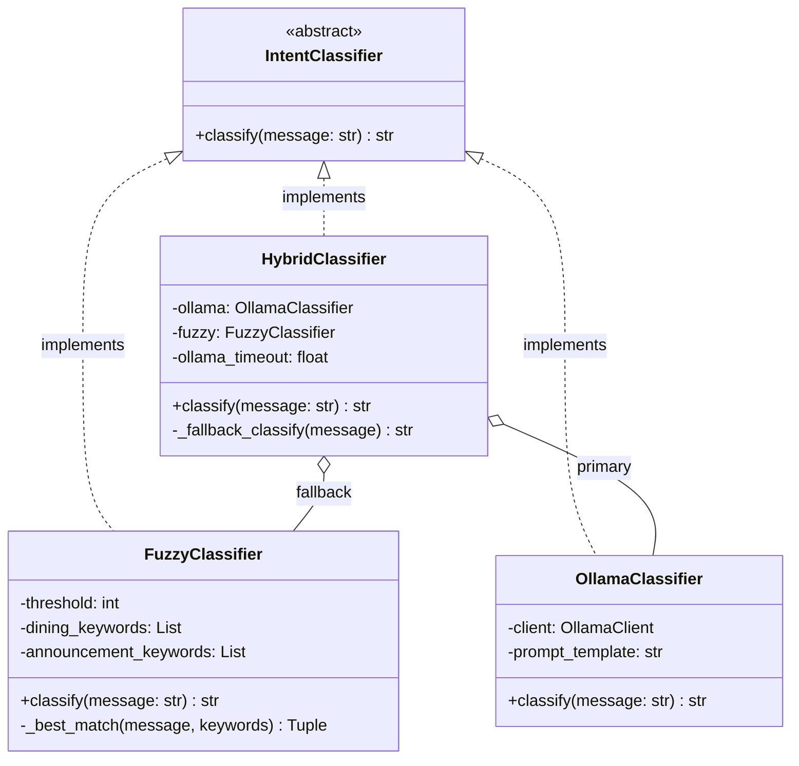
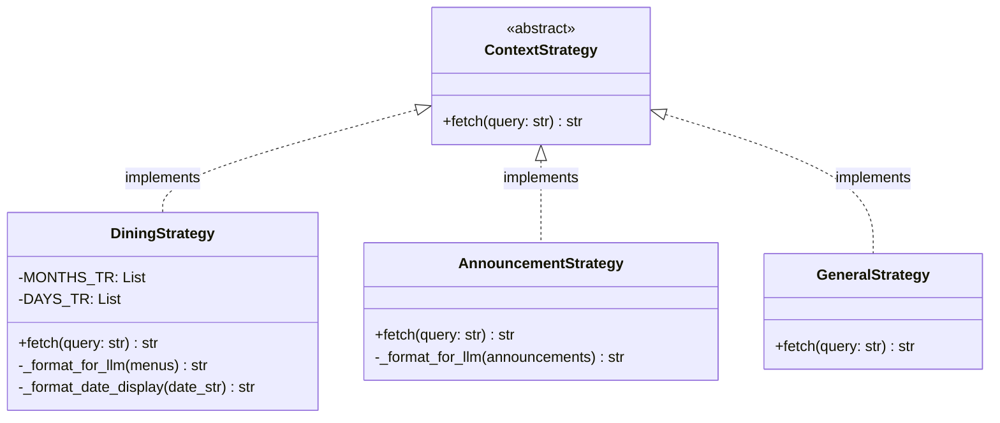
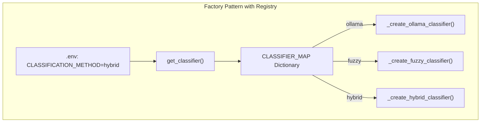
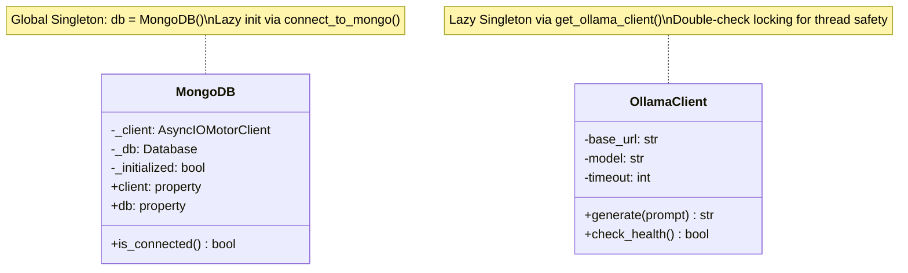
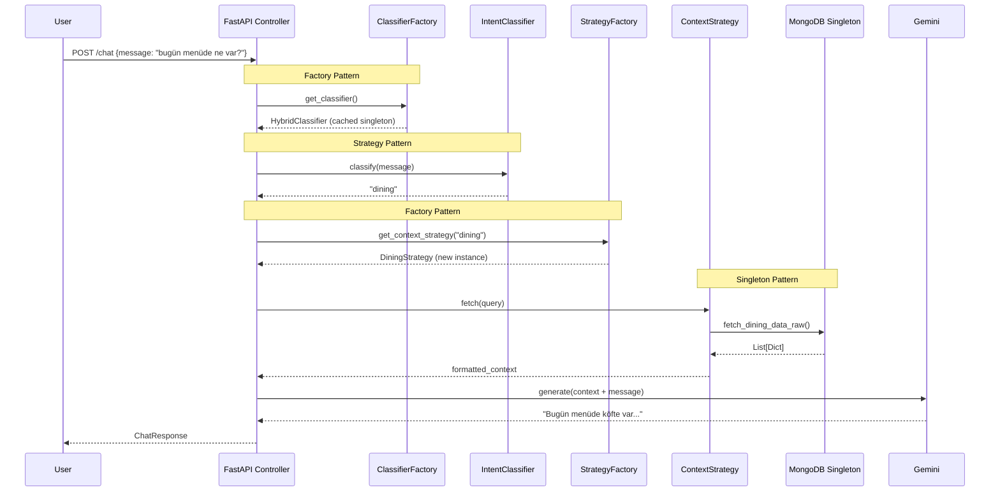

This document provides a detailed breakdown of the three design patterns used in the project: **Strategy**, **Factory**, and **Singleton**. Each section explains the problem, solution, implementation, and benefits.

---

## 1. Strategy Pattern (Behavioral)

### Problem Statement

The chatbot needs to determine user intent (dining, announcement, or general) and fetch appropriate context. We needed:

1. **Multiple classification algorithms**: Simple keyword matching (fast, offline) vs LLM-based analysis (smart, slower)
2. **Multiple context sources**: Dining menus, announcements, or general responses
3. **Runtime flexibility**: Switch algorithms via configuration without code changes

> [!IMPORTANT]
> Without Strategy Pattern, we would need complex `if-elif` chains that violate the Open-Closed Principle.

### Solution: Intent Classification Strategy

**Location**: `backend/app/llm_engine/classifiers/`



**Concrete Strategies:**

| Strategy | Algorithm | Use Case |
|----------|-----------|----------|
| `FuzzyClassifier` | Levenshtein distance matching | Fast, offline fallback |
| `OllamaClassifier` | Local LLM (Qwen 7B) semantic analysis | Accurate, requires Ollama server |
| `HybridClassifier` | Ollama with Fuzzy fallback | Best of both worlds |

**Implementation Example:**

```python
# Abstract Base Class (Strategy Interface)
class IntentClassifier(ABC):
    @abstractmethod
    async def classify(self, message: str) -> str:
        """Returns: 'dining', 'announcement', or 'general'"""
        pass

# Concrete Strategy: Hybrid (Composition of strategies)
class HybridClassifier(IntentClassifier):
    def __init__(self, ollama_classifier, fuzzy_classifier, ollama_timeout=5.0):
        self.ollama = ollama_classifier
        self.fuzzy = fuzzy_classifier
        self.ollama_timeout = ollama_timeout

    async def classify(self, message: str) -> str:
        try:
            # Try primary strategy with timeout
            return await asyncio.wait_for(
                self.ollama.classify(message),
                timeout=self.ollama_timeout
            )
        except (asyncio.TimeoutError, Exception):
            # Graceful degradation to fallback
            return await self.fuzzy.classify(message)
```

### Solution: Context Fetching Strategy

**Location**: `backend/app/strategies/context_strategies.py`



**Key Design Decision:**

> [!TIP]
> Each Strategy owns its formatting logic (prompt engineering). The Service layer returns raw `List[Dict]`, and the Strategy transforms it into an LLM-optimized string.

```python
class DiningStrategy(ContextStrategy):
    async def fetch(self, query: str) -> str:
        raw_menus = await fetch_dining_data_raw()  # Raw data from service
        return self._format_for_llm(raw_menus)     # Strategy handles formatting
    
    def _format_for_llm(self, menus: List[Dict]) -> str:
        # Turkish localization, date marking (BUGÜN/YARIN)
        # Emoji formatting for readability
        # Returns LLM-ready context string
```

### Benefits of Strategy Pattern

| Benefit | Description |
|---------|-------------|
| **Open-Closed Principle** | Add new classifiers without modifying existing code |
| **Single Responsibility** | Each strategy handles one algorithm |
| **Runtime Flexibility** | Switch via `.env` configuration |
| **Testability** | Mock strategies easily in unit tests |

---

## 2. Factory Pattern (Creational)

### Problem Statement

We need to create different classifier and strategy objects based on runtime configuration:

1. **Encapsulate creation logic**: Complex initialization (e.g., HybridClassifier needs two sub-classifiers)
2. **OCP Compliance**: Add new types without modifying factory code
3. **Centralized object creation**: Single point of change

### Solution: Dictionary Map Factory

**Location**: `backend/app/llm_engine/classifier.py`

Instead of traditional `if-elif` chains, we use a **dictionary registry**:



**Implementation:**

```python
# Factory Functions (one per classifier type)
def _create_ollama_classifier() -> IntentClassifier:
    return OllamaClassifier(client=get_ollama_client())

def _create_fuzzy_classifier() -> IntentClassifier:
    return FuzzyClassifier(threshold=settings.FUZZY_THRESHOLD)

def _create_hybrid_classifier() -> IntentClassifier:
    primary = OllamaClassifier(client=get_ollama_client())
    fallback = FuzzyClassifier(threshold=settings.FUZZY_THRESHOLD)
    return HybridClassifier(ollama_classifier=primary, fuzzy_classifier=fallback)

# OCP-Compliant Registry
CLASSIFIER_MAP: dict[str, Callable[[], IntentClassifier]] = {
    "ollama": _create_ollama_classifier,
    "fuzzy": _create_fuzzy_classifier,
    "hybrid": _create_hybrid_classifier,
}

def get_classifier() -> IntentClassifier:
    method = settings.CLASSIFICATION_METHOD
    factory_fn = CLASSIFIER_MAP.get(method, _create_fuzzy_classifier)
    return factory_fn()
```

### Adding a New Classifier (OCP Demonstration)

```python
# Step 1: Create factory function
def _create_bert_classifier() -> IntentClassifier:
    return BertClassifier(model="bert-base-turkish")

# Step 2: Add to registry (NO changes to get_classifier needed!)
CLASSIFIER_MAP["bert"] = _create_bert_classifier
```

### Strategy Factory

**Location**: `backend/app/strategies/context_strategies.py`

```python
# Registry stores CLASS REFERENCES, not instances
STRATEGY_MAP: dict[str, type[ContextStrategy]] = {
    "dining": DiningStrategy,
    "announcement": AnnouncementStrategy,
    "general": GeneralStrategy,
}

def get_context_strategy(intent: str) -> ContextStrategy:
    """Factory creates NEW instance each time (not Singleton)"""
    StrategyClass = STRATEGY_MAP.get(intent, GeneralStrategy)
    return StrategyClass()  # Fresh instance every call
```

> [!WARNING]
> **Factory vs Singleton**: Factory creates **new instances** on each call. This prevents state leakage between requests.

---

## 3. Singleton Pattern (Creational)

### Problem Statement

Creating database connections or LLM clients for every request is:

1. **Resource-intensive**: Connection pooling requires single connection manager
2. **Slow**: TCP handshake + authentication takes 50-100ms per connection
3. **Dangerous**: Can exhaust database connection limits

### Solution: Thread-Safe Lazy Singleton

**Locations**:
- `backend/app/db/mongo.py` - MongoDB connection
- `backend/app/llm_engine/clients/ollama_client.py` - Ollama client



### MongoDB Singleton Implementation

```python
class MongoDB:
    def __init__(self):
        self._client: AsyncIOMotorClient | None = None
        self._db = None
        self._initialized = False
    
    @property
    def client(self) -> AsyncIOMotorClient:
        if self._client is None:
            raise RuntimeError("MongoDB not connected. Call connect_to_mongo() first.")
        return self._client

# Global Singleton Instance
db = MongoDB()

async def connect_to_mongo():
    """Called once at application startup"""
    db._client = AsyncIOMotorClient(settings.MONGO_CONNECTION_STRING)
    db._db = db._client[settings.MONGO_DB_NAME]
    await db._client.admin.command('ping')
    db._initialized = True
```

### Ollama Client with Double-Check Locking

```python
_ollama_client_instance: Optional[OllamaClient] = None
_ollama_client_lock = threading.Lock()

def get_ollama_client() -> OllamaClient:
    global _ollama_client_instance
    
    # Fast path: already initialized (no lock needed)
    if _ollama_client_instance is not None:
        return _ollama_client_instance
    
    # Slow path: acquire lock and initialize
    with _ollama_client_lock:
        # Double-check: another thread might have initialized
        if _ollama_client_instance is None:
            _ollama_client_instance = OllamaClient(
                base_url=settings.OLLAMA_BASE_URL,
                model=settings.OLLAMA_MODEL
            )
    
    return _ollama_client_instance
```

> [!IMPORTANT]
> **Async Fix**: The `OllamaClient.generate()` uses `run_in_executor` to run blocking SDK calls in a thread pool, preventing Event Loop blocking.

### Benefits of Singleton Pattern

| Benefit | Description |
|---------|-------------|
| **Connection Pooling** | Motor client manages pool of connections |
| **Resource Efficiency** | One initialization, reused across requests |
| **Thread Safety** | Double-check locking prevents race conditions |
| **Fail-Fast** | Errors at startup, not during requests |

---

## Pattern Interaction: Chat Request Flow

The following sequence diagram shows how all three patterns work together:



---

## Summary Table

| Pattern | Category | Components | Problem Solved |
|---------|----------|------------|----------------|
| **Strategy** | Behavioral | `IntentClassifier`, `ContextStrategy` | Multiple algorithms with runtime selection |
| **Factory** | Creational | `get_classifier()`, `get_context_strategy()` | OCP-compliant object creation |
| **Singleton** | Creational | `MongoDB`, `OllamaClient` | Expensive resource management |
