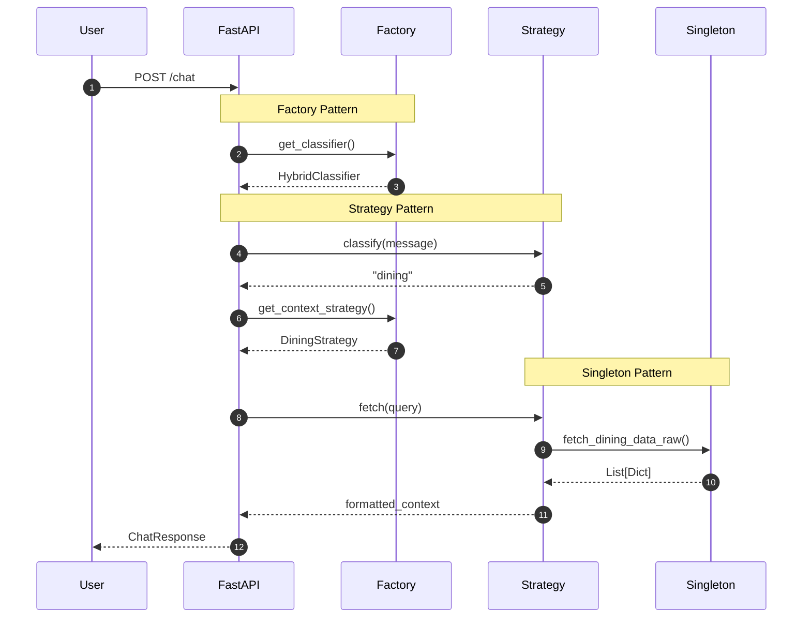

## Patterns Overview

This project demonstrates the practical application of **three core design patterns** from the Gang of Four catalog.

<CardGroup cols={3}>
  <Card title="Strategy" icon="arrows-split-up-and-left" color="#10B981" href="/patterns/strategy">
    **Behavioral** pattern for dynamic algorithm selection
  </Card>
  <Card title="Factory" icon="industry" color="#3B82F6" href="/patterns/factory">
    **Creational** pattern for OCP-compliant object creation
  </Card>
  <Card title="Singleton" icon="database" color="#8B5CF6" href="/patterns/singleton">
    **Creational** pattern for resource management
  </Card>
</CardGroup>

---

## Why These Patterns?

<AccordionGroup>
  <Accordion title="Strategy Pattern" icon="arrows-split-up-and-left" defaultOpen>
    **Problem:** Multiple classification algorithms needed with runtime switching
    
    **Solution:** Encapsulate each algorithm in a separate class implementing a common interface
    
    **Benefit:** Add new classifiers without modifying existing code
  </Accordion>
  
  <Accordion title="Factory Pattern" icon="industry">
    **Problem:** Complex object creation logic scattered throughout codebase
    
    **Solution:** Centralize creation in factory functions with dictionary registry
    
    **Benefit:** OCP compliance - extend without modifying
  </Accordion>
  
  <Accordion title="Singleton Pattern" icon="database">
    **Problem:** Expensive database/LLM client initialization on every request
    
    **Solution:** Single instance with lazy initialization and thread safety
    
    **Benefit:** Connection pooling, resource efficiency
  </Accordion>
</AccordionGroup>

---

## Pattern Interaction

<Steps>
  <Step title="User Sends Message">
    User sends "bugün menüde ne var?" via WhatsApp
  </Step>
  <Step title="Factory Creates Classifier">
    `get_classifier()` returns cached `HybridClassifier` (Singleton-like caching)
  </Step>
  <Step title="Strategy Classifies Intent">
    `HybridClassifier.classify()` returns `"dining"`
  </Step>
  <Step title="Factory Creates Strategy">
    `get_context_strategy("dining")` returns new `DiningStrategy` instance
  </Step>
  <Step title="Strategy Fetches Context">
    `DiningStrategy.fetch()` queries MongoDB (Singleton) and formats data
  </Step>
  <Step title="LLM Generates Response">
    Gemini generates response with context and sends back to user
  </Step>
</Steps>

---

## Sequence Diagram

---

## Summary Table

| Pattern | Category | Components | Problem Solved |
|---------|----------|------------|----------------|
| [Strategy](/patterns/strategy) | Behavioral | `IntentClassifier`, `ContextStrategy` | Multiple algorithms |
| [Factory](/patterns/factory) | Creational | `get_classifier()`, `get_context_strategy()` | Object creation |
| [Singleton](/patterns/singleton) | Creational | `MongoDB`, `OllamaClient` | Resource management |
