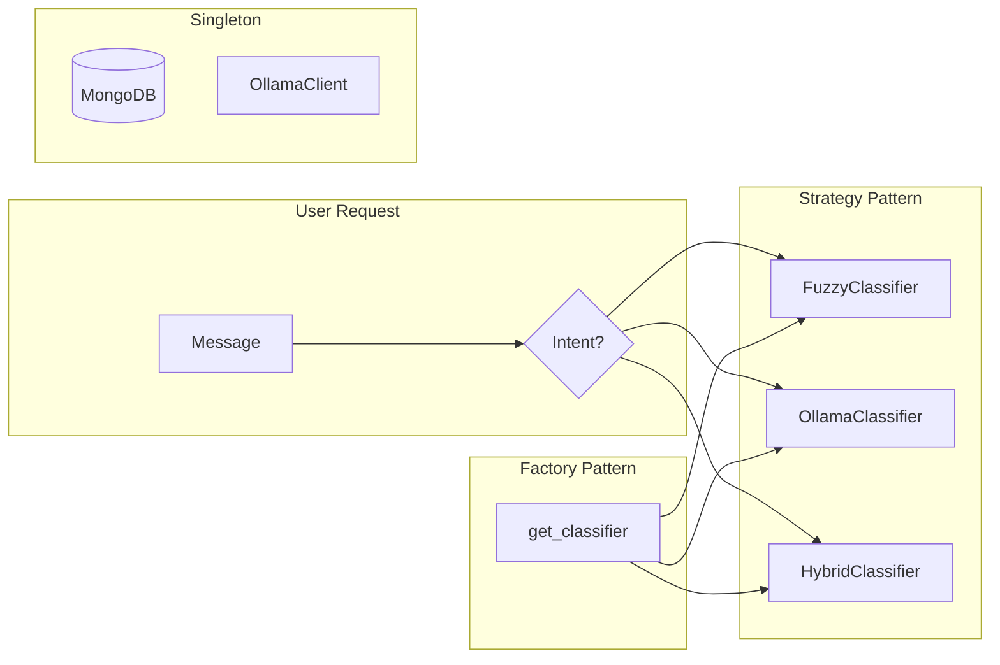

## CSE-351 Design Patterns Term Project

**ChatbotForCse** is an AI-powered assistant designed for Akdeniz University Computer Science students. This project demonstrates the practical application of **three core design patterns**: Strategy, Factory, and Singleton.

<CardGroup cols={2}>
  <Card title="Strategy Pattern" icon="arrows-split-up-and-left">
    Dynamic algorithm selection for intent classification and context fetching.
  </Card>
  <Card title="Factory Pattern" icon="industry">
    OCP-compliant object creation with dictionary-based registry.
  </Card>
  <Card title="Singleton Pattern" icon="database">
    Thread-safe resource management for database and LLM clients.
  </Card>
  <Card title="Layered Architecture" icon="layer-group">
    Clean separation of API, Service, Domain, and Data layers.
  </Card>
</CardGroup>

---

## Problem Statement

Students at Akdeniz University often struggle to access scattered information:

| Problem | Current Solution | Our Solution |
|---------|------------------|--------------|
| **Daily dining menus** | Check SKS website manually | Automated scraping + AI Q&A |
| **Department announcements** | Monitor CSE website | Real-time sync + intelligent search |
| **Academic questions** | Ask in WhatsApp groups | AI-powered instant responses |

> [!NOTE]
> Existing solutions require checking multiple websites or asking repetitive questions in group chats.

---

## Solution: ChatbotForCse

A unified **AI-powered chatbot** accessible via WhatsApp and Mobile App. It aggregates data from university sources and uses LLMs for context-aware responses.

### Key Features

*   🍽️ **Dining Menus**: Scrapes weekly menus from SKS, parses images using Gemini Vision
*   📢 **Announcements**: Tracks and delivers department news in real-time
*   🤖 **Intelligent Q&A**: Uses Gemini and Ollama for general questions
*   📱 **Multi-Channel**: Live on WhatsApp, API ready for mobile

---

## Design Pattern Integration

This project showcases how design patterns solve real problems:

**Why These Patterns?**

| Pattern | Problem Solved | Benefit |
|---------|----------------|---------|
| **Strategy** | Multiple classification algorithms needed | Runtime flexibility, easy testing |
| **Factory** | Complex object creation logic | OCP compliance, centralized creation |
| **Singleton** | Expensive resource initialization | Connection pooling, thread safety |
