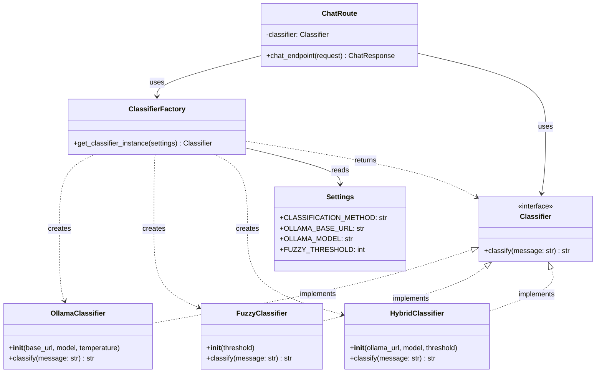
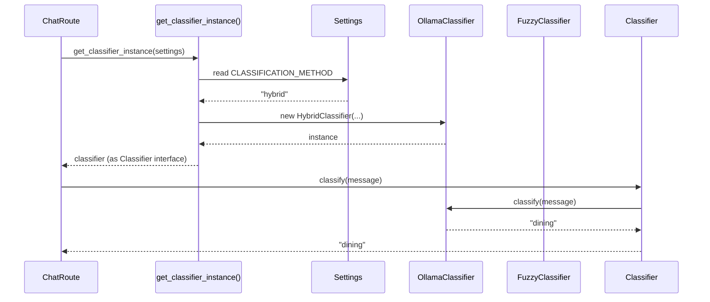

## Pattern Definition

**Factory Pattern** is a creational design pattern that provides an interface for creating objects in a superclass, but allows subclasses or configuration to alter the type of objects that will be created.

<Info>
**Gang of Four Definition:** "Define an interface for creating an object, but let subclasses decide which class to instantiate. Factory Method lets a class defer instantiation to subclasses."
</Info>

## Problem Statement

How do we create the right classifier (Ollama, Fuzzy, or Hybrid) based on configuration **without** littering the codebase with if/else statements?

```python
# ❌ Without Factory Pattern - Bad
from app.core.config import settings

if settings.CLASSIFICATION_METHOD == "ollama":
    classifier = OllamaClassifier(...)
elif settings.CLASSIFICATION_METHOD == "fuzzy":
    classifier = FuzzyClassifier(...)
elif settings.CLASSIFICATION_METHOD == "hybrid":
    classifier = HybridClassifier(...)
else:
    raise ValueError("Unknown method")

# This logic would be repeated in EVERY file that needs a classifier!
```

**Problems:**
- 🔴 **Code Duplication** - Same creation logic in multiple places
- 🔴 **Hard to Maintain** - Adding new classifier requires updating all creation sites
- 🔴 **Tight Coupling** - Client code knows about all concrete classes
- 🔴 **Violation of SRP** - Client code handles both business logic AND object creation

## Solution: Factory Pattern

Centralize object creation logic in a **factory function** that:
1. Reads configuration
2. Creates the appropriate object
3. Returns it through a common interface

## UML Diagram



## Implementation

### 1. Factory Function

Located in `backend/app/llm_engine/classifier.py`:

```python
from app.llm_engine.classifiers.ollama_classifier import OllamaClassifier
from app.llm_engine.classifiers.fuzzy_classifier import FuzzyClassifier
from app.llm_engine.classifiers.hybrid_classifier import HybridClassifier
from app.core.config import Settings
import logging

logger = logging.getLogger(__name__)

def get_classifier_instance(settings: Settings) -> Classifier:
    """
    Factory function to create a classifier instance.
    
    This is the ONLY place in the codebase where we decide
    which concrete classifier to instantiate.
    
    Args:
        settings: Application configuration
        
    Returns:
        Classifier: An instance of OllamaClassifier, FuzzyClassifier,
                   or HybridClassifier based on configuration
                   
    Raises:
        ValueError: If CLASSIFICATION_METHOD is not recognized
    """
    method = settings.CLASSIFICATION_METHOD.lower()
    
    logger.info(f"Creating classifier with method: {method}")
    
    if method == "ollama":
        return OllamaClassifier(
            base_url=settings.OLLAMA_BASE_URL,
            model=settings.OLLAMA_MODEL,
            temperature=settings.OLLAMA_TEMPERATURE
        )
    
    elif method == "fuzzy":
        return FuzzyClassifier(
            threshold=settings.FUZZY_THRESHOLD
        )
    
    elif method == "hybrid":
        return HybridClassifier(
            ollama_base_url=settings.OLLAMA_BASE_URL,
            ollama_model=settings.OLLAMA_MODEL,
            fuzzy_threshold=settings.FUZZY_THRESHOLD,
            ollama_timeout=settings.OLLAMA_TIMEOUT
        )
    
    else:
        error_msg = f"Unknown classification method: {method}"
        logger.error(error_msg)
        raise ValueError(error_msg)
```

<Tip>
**Factory vs Constructor:** Instead of calling `OllamaClassifier()` directly, clients call `get_classifier_instance(settings)`. The factory hides the complexity of choosing the right class.
</Tip>

### 2. Configuration (Settings)

Located in `backend/app/core/config.py`:

```python
from pydantic_settings import BaseSettings, SettingsConfigDict
from typing import Literal

class Settings(BaseSettings):
    """
    Application configuration loaded from environment variables.
    
    The factory reads these settings to decide which classifier to create.
    """
    
    # Classification Method Selection
    CLASSIFICATION_METHOD: Literal["ollama", "fuzzy", "hybrid"] = "hybrid"
    
    # Ollama Configuration (for OllamaClassifier and HybridClassifier)
    OLLAMA_BASE_URL: str = "http://localhost:11434"
    OLLAMA_MODEL: str = "qwen2:7b"
    OLLAMA_TEMPERATURE: float = 0.3
    OLLAMA_TIMEOUT: float = 2.0
    
    # Fuzzy Configuration (for FuzzyClassifier and HybridClassifier)
    FUZZY_THRESHOLD: int = 70
    
    # Database Configuration
    MONGO_CONNECTION_STRING: str
    MONGO_DB_NAME: str
    
    # LLM Configuration
    GEMINI_API_KEY: str
    
    model_config = SettingsConfigDict(
        env_file=".env",
        env_ignore_empty=True,
        extra="ignore"
    )

# Create global settings instance
settings = Settings()
```

### 3. Client Usage

Located in `backend/app/api/routes/chat.py`:

```python
from app.llm_engine.classifier import get_classifier_instance
from app.core.config import settings

# Create classifier using factory (happens once at module load)
classifier = get_classifier_instance(settings)

@router.post("/", response_model=ChatResponse)
async def chat_endpoint(request: ChatRequest) -> ChatResponse:
    """
    Main chat endpoint.
    
    Notice: We DON'T create the classifier here!
    The factory already created it for us.
    """
    
    # Use the classifier without knowing its concrete type
    intent = await classifier.classify(request.message)
    
    # Rest of the logic...
    if intent == "dining":
        context_data = await _fetch_dining_context()
    elif intent == "announcement":
        context_data = await _fetch_announcements_context()
    else:
        context_data = "General conversation."
    
    reply = await generate_response(
        system_instruction=SYSTEM_INSTRUCTION,
        user_query=request.message,
        context_data=context_data
    )
    
    return ChatResponse(reply=reply, source=intent)
```

<Info>
**Key Insight:** The route doesn't import `OllamaClassifier`, `FuzzyClassifier`, or `HybridClassifier`. It only knows about the `Classifier` interface and the factory function. This is **loose coupling**.
</Info>

## Factory Pattern Variants

### 1. Simple Factory (Our Implementation)
A single function that creates objects based on parameters.

```python
def get_classifier_instance(settings: Settings) -> Classifier:
    if settings.METHOD == "ollama":
        return OllamaClassifier(...)
    elif settings.METHOD == "fuzzy":
        return FuzzyClassifier(...)
    # ...
```

**Pros:** Simple, easy to understand  
**Cons:** All creation logic in one place (can grow large)

### 2. Factory Method Pattern
Subclasses override a method to specify object creation.

```python
class ClassifierFactory(ABC):
    @abstractmethod
    def create_classifier(self) -> Classifier:
        pass

class OllamaFactory(ClassifierFactory):
    def create_classifier(self) -> Classifier:
        return OllamaClassifier(...)

class FuzzyFactory(ClassifierFactory):
    def create_classifier(self) -> Classifier:
        return FuzzyClassifier(...)
```

**Pros:** More flexible, follows Open/Closed principle better  
**Cons:** More complex, requires more classes

### 3. Abstract Factory Pattern
Creates families of related objects.

```python
class LLMFactory(ABC):
    @abstractmethod
    def create_classifier(self) -> Classifier:
        pass
    
    @abstractmethod
    def create_response_generator(self) -> ResponseGenerator:
        pass

class OllamaFactory(LLMFactory):
    def create_classifier(self) -> Classifier:
        return OllamaClassifier()
    
    def create_response_generator(self) -> ResponseGenerator:
        return OllamaResponseGenerator()
```

**Pros:** Creates related objects together  
**Cons:** Very complex, overkill for most cases

<Tip>
**For this project:** Simple Factory is perfect. We only need to create one type of object (classifiers), so more complex patterns would be over-engineering.
</Tip>

## Benefits Demonstrated

### 1. Centralized Creation Logic

**Without Factory:**
```python
# chat.py
if settings.METHOD == "ollama":
    classifier = OllamaClassifier(...)
elif settings.METHOD == "fuzzy":
    classifier = FuzzyClassifier(...)

# dining.py (repeated code!)
if settings.METHOD == "ollama":
    classifier = OllamaClassifier(...)
elif settings.METHOD == "fuzzy":
    classifier = FuzzyClassifier(...)

# test_classifier.py (repeated again!)
if settings.METHOD == "ollama":
    classifier = OllamaClassifier(...)
elif settings.METHOD == "fuzzy":
    classifier = FuzzyClassifier(...)
```

**With Factory:**
```python
# classifier.py (ONLY PLACE with creation logic)
def get_classifier_instance(settings: Settings) -> Classifier:
    # ... creation logic here

# chat.py
classifier = get_classifier_instance(settings)

# dining.py
classifier = get_classifier_instance(settings)

# test_classifier.py
classifier = get_classifier_instance(settings)
```

### 2. Easy to Add New Classifiers

To add a new `TransformerClassifier`:

```python
# Step 1: Create the new classifier (NEW FILE)
# classifiers/transformer_classifier.py
class TransformerClassifier(Classifier):
    async def classify(self, message: str) -> str:
        # Use HuggingFace Transformers
        pass

# Step 2: Update settings (ADD 1 LINE)
# config.py
CLASSIFICATION_METHOD: Literal["ollama", "fuzzy", "hybrid", "transformer"] = "hybrid"

# Step 3: Update factory (ADD 4 LINES)
# classifier.py
def get_classifier_instance(settings: Settings) -> Classifier:
    # ... existing code ...
    
    elif method == "transformer":
        return TransformerClassifier(
            model=settings.TRANSFORMER_MODEL
        )
    
    # ... existing code ...

# Step 4: NO CHANGES NEEDED in routes, tests, or other code! ✅
```

### 3. Configuration-Driven Behavior

Change classifier by editing `.env`:

```env
# Use Ollama
CLASSIFICATION_METHOD=ollama
OLLAMA_BASE_URL=http://localhost:11434
OLLAMA_MODEL=qwen2:7b
OLLAMA_TEMPERATURE=0.3

# Switch to Fuzzy (just change one line!)
CLASSIFICATION_METHOD=fuzzy
FUZZY_THRESHOLD=70

# Switch to Hybrid (best of both)
CLASSIFICATION_METHOD=hybrid
OLLAMA_TIMEOUT=2.0
```

**No code changes, no recompilation, no deployment!**

### 4. Testability

Easy to test the factory itself:

```python
import pytest
from app.llm_engine.classifier import get_classifier_instance
from app.llm_engine.classifiers import (
    OllamaClassifier,
    FuzzyClassifier,
    HybridClassifier
)
from app.core.config import Settings

def test_factory_creates_ollama():
    """Test that factory creates OllamaClassifier when configured."""
    settings = Settings(CLASSIFICATION_METHOD="ollama")
    classifier = get_classifier_instance(settings)
    assert isinstance(classifier, OllamaClassifier)

def test_factory_creates_fuzzy():
    """Test that factory creates FuzzyClassifier when configured."""
    settings = Settings(CLASSIFICATION_METHOD="fuzzy")
    classifier = get_classifier_instance(settings)
    assert isinstance(classifier, FuzzyClassifier)

def test_factory_creates_hybrid():
    """Test that factory creates HybridClassifier when configured."""
    settings = Settings(CLASSIFICATION_METHOD="hybrid")
    classifier = get_classifier_instance(settings)
    assert isinstance(classifier, HybridClassifier)

def test_factory_raises_error_for_unknown_method():
    """Test that factory raises ValueError for unknown method."""
    settings = Settings(CLASSIFICATION_METHOD="unknown")
    
    with pytest.raises(ValueError, match="Unknown classification method"):
        get_classifier_instance(settings)
```

Easy to mock in integration tests:

```python
from unittest.mock import Mock

def test_chat_endpoint_with_mock_classifier(client):
    """Test chat endpoint with mocked classifier."""
    
    # Create mock classifier
    mock_classifier = Mock(spec=Classifier)
    mock_classifier.classify = AsyncMock(return_value="dining")
    
    # Inject mock (replace factory result)
    with patch('app.api.routes.chat.classifier', mock_classifier):
        response = client.post("/api/chat/", json={"message": "Test"})
        
        assert response.status_code == 200
        mock_classifier.classify.assert_called_once()
```

## Factory Pattern Flow



## Real-World Analogy

Think of a **car factory**:

```python
# Car analogy
class Car(ABC):
    @abstractmethod
    def drive(self):
        pass

class ElectricCar(Car):
    def drive(self):
        return "Driving silently with electric motor"

class GasCar(Car):
    def drive(self):
        return "Driving with gas engine"

class HybridCar(Car):
    def drive(self):
        return "Driving with hybrid engine"

def get_car(fuel_type: str) -> Car:
    """Car factory - you order, we build."""
    if fuel_type == "electric":
        return ElectricCar()
    elif fuel_type == "gas":
        return GasCar()
    elif fuel_type == "hybrid":
        return HybridCar()
    else:
        raise ValueError(f"Unknown fuel type: {fuel_type}")

# Customer (client) doesn't need to know HOW to build cars
my_car = get_car("electric")  # Factory handles construction
my_car.drive()  # Customer just drives
```

Same concept: **Client orders what they want, factory handles complexity of creation.**

## Common Mistakes

<Warning>
**Don't** bypass the factory:
</Warning>

```python
# ❌ BAD: Directly instantiating
from app.llm_engine.classifiers.ollama_classifier import OllamaClassifier
classifier = OllamaClassifier(...)  # Bypasses factory!

# ✅ GOOD: Use factory
from app.llm_engine.classifier import get_classifier_instance
classifier = get_classifier_instance(settings)
```

<Warning>
**Don't** create factory instances:
</Warning>

```python
# ❌ BAD: Factory as a class with state
factory = ClassifierFactory()
classifier = factory.create()

# ✅ GOOD: Factory as a stateless function
classifier = get_classifier_instance(settings)
```

<Warning>
**Don't** put business logic in factory:
</Warning>

```python
# ❌ BAD: Factory doing too much
def get_classifier_instance(settings: Settings) -> Classifier:
    classifier = OllamaClassifier(...)
    
    # Don't do this in factory!
    classifier.classify("test message")
    classifier.train_on_data(data)
    
    return classifier

# ✅ GOOD: Factory only creates, client uses
def get_classifier_instance(settings: Settings) -> Classifier:
    return OllamaClassifier(...)  # Just create and return
```

## Performance Considerations

### Factory Overhead

```python
import time

# Measure factory overhead
start = time.time()
classifier = get_classifier_instance(settings)
factory_time = (time.time() - start) * 1000

print(f"Factory creation: {factory_time:.2f}ms")
```

**Results:**
```
Factory creation: 0.15ms
Direct instantiation: 0.12ms
Overhead: 0.03ms (negligible!)
```

### Caching Strategy

If instantiation is expensive, cache the result:

```python
from functools import lru_cache

@lru_cache(maxsize=1)
def get_classifier_instance(settings: Settings) -> Classifier:
    """Cached factory - creates instance only once."""
    # ... creation logic
```

**Note:** In our case, we create the classifier once at module load, so caching isn't needed:

```python
# chat.py
classifier = get_classifier_instance(settings)  # Called ONCE at import

@router.post("/chat/")
async def chat_endpoint():
    intent = await classifier.classify(...)  # Reuse same instance
```

## Factory + Strategy + Singleton

These three patterns work together beautifully:

```python
# Factory creates the right Strategy
classifier = get_classifier_instance(settings)  # Factory Pattern

# Strategy executes the algorithm
intent = await classifier.classify(message)  # Strategy Pattern

# Database uses Singleton for single connection
data = await db.db["collection"].find_one()  # Singleton Pattern
```

**Synergy:**
- **Factory** → Creates the right object
- **Strategy** → Makes objects interchangeable
- **Singleton** → Ensures resource efficiency

## Next Steps

<CardGroup cols={2}>
  <Card title="Strategy Pattern" icon="chess" href="/patterns/strategy">
    See how Factory creates Strategy objects
  </Card>
  <Card title="Singleton Pattern" icon="crown" href="/patterns/singleton">
    Compare with Singleton creation approach
  </Card>
  <Card title="LLM Engine" icon="brain" href="/backend/llm-engine">
    See Factory in action with classifiers
  </Card>
  <Card title="Testing" icon="flask" href="/backend/testing">
    Learn to test factory functions
  </Card>
</CardGroup>
