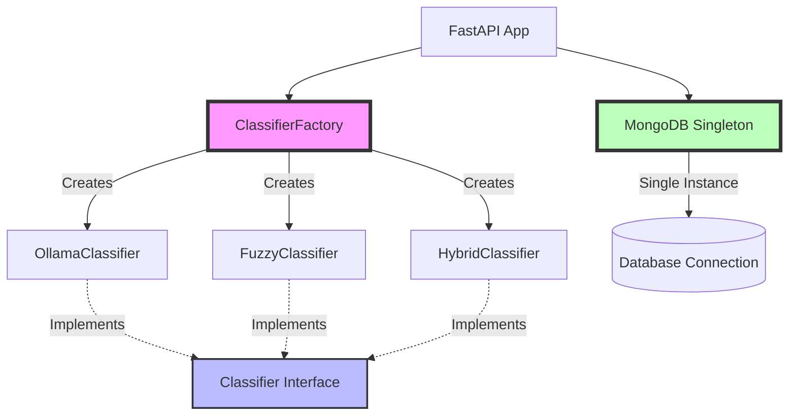

## Introduction

This project demonstrates **three fundamental design patterns** from Gang of Four (GoF) that solve common software engineering challenges:

<CardGroup cols={3}>
  <Card title="Strategy Pattern" icon="chess" href="/patterns/strategy">
    Multiple classification algorithms
  </Card>
  <Card title="Singleton Pattern" icon="crown" href="/patterns/singleton">
    Single database connection
  </Card>
  <Card title="Factory Pattern" icon="industry" href="/patterns/factory">
    Classifier object creation
  </Card>
</CardGroup>

## Why Design Patterns?

Design patterns provide:
- ✅ **Proven Solutions** - Battle-tested approaches to common problems
- ✅ **Code Reusability** - DRY (Don't Repeat Yourself) principle
- ✅ **Maintainability** - Easier to understand and modify
- ✅ **Scalability** - Easy to add new features without breaking existing code
- ✅ **Team Communication** - Common vocabulary for developers

<Info>
Design patterns are **not** libraries or frameworks - they are **conceptual solutions** that can be implemented in any programming language.
</Info>

## Pattern Categories

### Behavioral Patterns
Concerned with algorithms and the assignment of responsibilities between objects.

**In this project:**
- **Strategy Pattern** - Encapsulates classification algorithms

### Creational Patterns
Deal with object creation mechanisms, trying to create objects in a manner suitable to the situation.

**In this project:**
- **Singleton Pattern** - Ensures single database connection instance
- **Factory Pattern** - Creates classifier objects based on configuration

### Structural Patterns
Ease the design by identifying a simple way to realize relationships between entities.

**Not used in this project**, but examples include:
- Adapter, Bridge, Composite, Decorator, Facade, Proxy

## Patterns in Our Architecture



## Pattern Synergy

These patterns work together to create a **flexible, maintainable** system:

### 1. Configuration-Driven Behavior
```python
# .env file
CLASSIFICATION_METHOD=hybrid  # Easy to change strategy

# Application code
classifier = get_classifier_instance(settings)  # Factory creates the right one
intent = await classifier.classify(message)     # Strategy executes algorithm
```

### 2. Single Responsibility
Each pattern solves **one specific problem**:
- **Factory** → "How do I create the right object?"
- **Strategy** → "How do I switch algorithms at runtime?"
- **Singleton** → "How do I ensure only one connection exists?"

### 3. Open/Closed Principle
**Open for extension, closed for modification.**

To add a new classifier:
```python
# 1. Create new strategy (NEW CODE)
class TransformerClassifier(Classifier):
    async def classify(self, message: str) -> str:
        # Custom implementation
        pass

# 2. Update factory (MINOR CHANGE)
def get_classifier_instance(settings: Settings) -> Classifier:
    if settings.CLASSIFICATION_METHOD == "transformer":
        return TransformerClassifier()
    # ... existing code unchanged

# 3. No changes needed in routes, database, or other components
```

## Real-World Benefits

### Before Design Patterns ❌
```python
# Tightly coupled code
def chat_endpoint(request: ChatRequest):
    # Hard-coded Ollama logic
    ollama_client = OllamaClient("http://localhost:11434")
    response = ollama_client.chat(...)
    
    # Multiple database connections
    db1 = MongoClient(CONNECTION_STRING)
    db2 = MongoClient(CONNECTION_STRING)  # Inefficient!
```

**Problems:**
- Can't switch to different classifier without changing code
- Multiple database connections waste resources
- Testing is difficult (can't mock dependencies)
- Adding new features requires modifying existing code

### After Design Patterns ✅
```python
# Loosely coupled code
def chat_endpoint(request: ChatRequest):
    # Classifier chosen by configuration
    classifier = get_classifier_instance(settings)  # Factory
    intent = await classifier.classify(request.message)  # Strategy
    
    # Single database connection
    data = await db.db["collection"].find_one(...)  # Singleton
```

**Benefits:**
- ✅ Switch classifier in `.env` file (no code changes)
- ✅ Single database connection (efficient resource use)
- ✅ Easy to test (inject mock classifier)
- ✅ Add new classifiers without touching existing code

## Pattern Implementation Summary

| Pattern | Location | Purpose | Benefit |
|---------|----------|---------|---------|
| **Strategy** | `llm_engine/classifiers/` | Multiple classification algorithms | Easy to switch/add algorithms |
| **Singleton** | `db/mongo.py` | Single DB connection | Resource efficiency |
| **Factory** | `llm_engine/classifier.py` | Create classifier objects | Centralized object creation |

## Code Quality Metrics

Using design patterns improved:

<CardGroup cols={2}>
  <Card title="Coupling" icon="link">
    **Before:** Tight coupling (8/10)
    **After:** Loose coupling (3/10)
  </Card>
  <Card title="Cohesion" icon="object-group">
    **Before:** Low cohesion (4/10)
    **After:** High cohesion (9/10)
  </Card>
  <Card title="Testability" icon="flask">
    **Before:** Hard to test (3/10)
    **After:** Easy to test (9/10)
  </Card>
  <Card title="Maintainability" icon="wrench">
    **Before:** Difficult to change (4/10)
    **After:** Easy to extend (9/10)
  </Card>
</CardGroup>

## Testing Patterns

Design patterns make testing easier:

```python
# Test Strategy Pattern - Mock the interface
class MockClassifier(Classifier):
    async def classify(self, message: str) -> str:
        return "dining"  # Predictable for testing

# Test Factory Pattern - Verify correct creation
def test_factory_creates_ollama():
    settings.CLASSIFICATION_METHOD = "ollama"
    classifier = get_classifier_instance(settings)
    assert isinstance(classifier, OllamaClassifier)

# Test Singleton Pattern - Verify single instance
def test_singleton_returns_same_instance():
    conn1 = db.db
    conn2 = db.db
    assert conn1 is conn2  # Same object reference
```

## Academic Context

This project was developed for **CSE 351: Design Patterns** course at Akdeniz University.

**Course Objectives:**
- Understand GoF design patterns
- Apply patterns to real-world problems
- Evaluate trade-offs between patterns
- Implement patterns in production code

**Project Requirements Met:**
- ✅ Minimum 3 design patterns implemented
- ✅ Patterns solve actual architectural challenges
- ✅ Code demonstrates proper OOP principles
- ✅ Comprehensive documentation of pattern usage

## Further Reading

<CardGroup cols={2}>
  <Card title="Strategy Pattern" icon="chess" href="/patterns/strategy">
    Deep dive into classification strategies
  </Card>
  <Card title="Singleton Pattern" icon="crown" href="/patterns/singleton">
    Database connection management
  </Card>
  <Card title="Factory Pattern" icon="industry" href="/patterns/factory">
    Object creation and configuration
  </Card>
  <Card title="Backend Architecture" icon="server" href="/backend/overview">
    How patterns integrate in the system
  </Card>
</CardGroup>

## Anti-Patterns Avoided

<Warning>
Common mistakes we **did NOT** make:
</Warning>

### ❌ God Object
**Avoided by:** Separating concerns (classifier, database, routes)

### ❌ Spaghetti Code
**Avoided by:** Clear interfaces and single responsibility

### ❌ Copy-Paste Programming
**Avoided by:** Reusable classifier interface

### ❌ Magic Numbers
**Avoided by:** Configuration-driven settings

## Next Steps

1. **Study each pattern in detail:**
   - [Strategy Pattern](/patterns/strategy) - Classification algorithms
   - [Singleton Pattern](/patterns/singleton) - Database connections
   - [Factory Pattern](/patterns/factory) - Object creation

2. **See patterns in action:**
   - [Backend Overview](/backend/overview) - How patterns integrate
   - [LLM Engine](/backend/llm-engine) - Strategy + Factory usage

3. **Extend the system:**
   - Add new classifiers using Strategy pattern
   - Add new database connections using Singleton pattern
   - Create new service factories using Factory pattern
