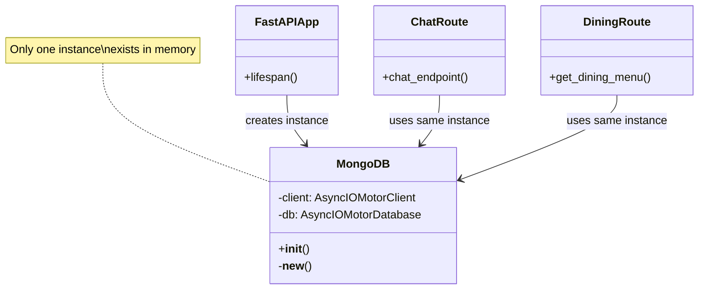
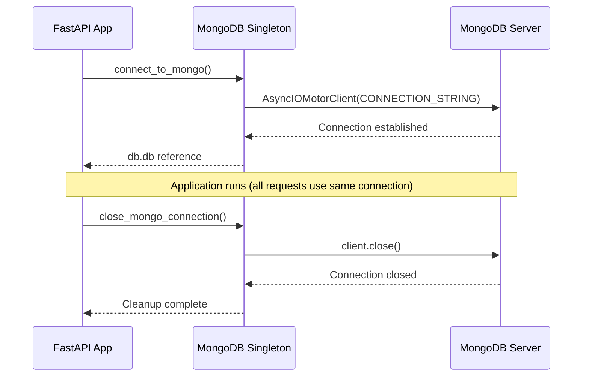

## Pattern Definition

**Singleton Pattern** is a creational design pattern that ensures a class has only one instance and provides a global point of access to that instance.

<Info>
**Gang of Four Definition:** "Ensure a class only has one instance, and provide a global point of access to it."
</Info>

## Problem Statement

When working with database connections, creating multiple connection instances causes:
- 🔴 **Resource Waste** - Each connection consumes memory and network resources
- 🔴 **Connection Pool Exhaustion** - MongoDB limits concurrent connections
- 🔴 **Inconsistent State** - Multiple connections may have different transaction states
- 🔴 **Slower Performance** - Connection establishment has overhead

**Question:** How do we ensure only **one** database connection exists throughout the application lifecycle?

**Answer:** Singleton Pattern.

## Solution: Singleton Pattern

Create a single instance of the database connection when the application starts, and reuse it for all database operations.

## UML Diagram



## Implementation

### Python Singleton Implementation

Located in `backend/app/db/mongo.py`:

```python
from motor.motor_asyncio import AsyncIOMotorClient
from app.core.config import settings
import logging

logger = logging.getLogger(__name__)

class MongoDB:
    """
    Singleton class for MongoDB connection.
    
    Ensures only one database connection exists throughout
    the application lifecycle.
    """
    
    # Class-level attributes (shared across all instances)
    client: AsyncIOMotorClient = None
    db = None

# Create the single instance
db = MongoDB()

async def connect_to_mongo():
    """
    Initialize the MongoDB connection.
    
    This should be called once during application startup.
    """
    if db.client is not None:
        logger.warning("MongoDB client already connected")
        return
    
    try:
        logger.info(f"Connecting to MongoDB...")
        
        # Create single Motor client instance
        db.client = AsyncIOMotorClient(
            settings.MONGO_CONNECTION_STRING,
            maxPoolSize=10,  # Connection pool size
            minPoolSize=1
        )
        
        # Get database reference
        db.db = db.client[settings.MONGO_DB_NAME]
        
        # Verify connection
        await db.client.admin.command('ping')
        
        logger.info("Successfully connected to MongoDB")
        
    except Exception as e:
        logger.error(f"Failed to connect to MongoDB: {e}")
        raise

async def close_mongo_connection():
    """
    Close the MongoDB connection.
    
    This should be called once during application shutdown.
    """
    if db.client is None:
        logger.warning("MongoDB client not connected")
        return
    
    try:
        logger.info("Closing MongoDB connection...")
        db.client.close()
        db.client = None
        db.db = None
        logger.info("MongoDB connection closed")
        
    except Exception as e:
        logger.error(f"Error closing MongoDB connection: {e}")
        raise
```

<Tip>
**Python Singleton Pattern:** Unlike Java/C++, Python doesn't require complex singleton implementations. We can simply create a module-level instance (`db = MongoDB()`), and Python's import system ensures it's only created once.
</Tip>

### Application Lifecycle Integration

Located in `backend/main.py`:

```python
from contextlib import asynccontextmanager
from fastapi import FastAPI
from app.db.mongo import connect_to_mongo, close_mongo_connection

@asynccontextmanager
async def lifespan(app: FastAPI):
    """
    Manage application lifecycle events.
    
    Startup: Create singleton database connection
    Shutdown: Close singleton database connection
    """
    # Startup
    logger.info("Application startup...")
    await connect_to_mongo()  # Create singleton instance
    
    yield  # Application runs
    
    # Shutdown
    logger.info("Application shutdown...")
    await close_mongo_connection()  # Clean up singleton

app = FastAPI(
    title="Akdeniz CSE AI Assistant",
    lifespan=lifespan
)
```

**Lifecycle Flow:**


### Usage in Routes

All routes use the **same** singleton instance:

```python
from app.db.mongo import db

@router.post("/api/chat/")
async def chat_endpoint(request: ChatRequest):
    # Use singleton database instance
    announcements = await db.db["cse_akdeniz_announcements"].find().to_list(10)
    # ... rest of logic

@router.get("/api/dining/{date}")
async def get_dining_menu(date: str):
    # Same singleton instance used here
    menu = await db.db["yemekhane_listesi"].find_one({"date": date})
    return menu

@router.get("/api/announcements/")
async def get_announcements():
    # And here too - all share the same connection
    cursor = db.db["cse_akdeniz_announcements"].find().sort("created_at", -1)
    return await cursor.to_list(10)
```

## Benefits Demonstrated

### 1. Resource Efficiency

**Without Singleton (Bad):**
```python
# ❌ Multiple connections created
@router.post("/api/chat/")
async def chat_endpoint():
    client1 = AsyncIOMotorClient(CONNECTION_STRING)  # New connection
    db1 = client1["chatbot_db"]
    # ...

@router.get("/api/dining/")
async def dining_endpoint():
    client2 = AsyncIOMotorClient(CONNECTION_STRING)  # Another connection!
    db2 = client2["chatbot_db"]
    # ...
```

**Result:** 
- 🔴 50+ connections for 50 requests
- 🔴 High memory usage
- 🔴 Connection pool exhaustion

**With Singleton (Good):**
```python
# ✅ Single connection reused
from app.db.mongo import db

@router.post("/api/chat/")
async def chat_endpoint():
    # Reuse singleton connection
    data = await db.db["collection"].find_one()

@router.get("/api/dining/")
async def dining_endpoint():
    # Same singleton connection
    data = await db.db["collection"].find_one()
```

**Result:**
- ✅ 1 connection for 50 requests
- ✅ Low memory usage
- ✅ Efficient connection pooling

### 2. Consistent State

All parts of the application see the **same** database state:

```python
# Transaction consistency example
async def transfer_credits(from_user: str, to_user: str, amount: int):
    # All operations use same connection = same transaction context
    async with await db.client.start_session() as session:
        async with session.start_transaction():
            # Debit
            await db.db["users"].update_one(
                {"user_id": from_user},
                {"$inc": {"credits": -amount}},
                session=session
            )
            
            # Credit
            await db.db["users"].update_one(
                {"user_id": to_user},
                {"$inc": {"credits": amount}},
                session=session
            )
            
            # Commit transaction
            await session.commit_transaction()
```

### 3. Lazy Initialization

Connection is created only when needed:

```python
class MongoDB:
    client = None  # Not created yet
    db = None

# During app startup:
await connect_to_mongo()  # NOW it's created

# During requests:
data = await db.db["collection"].find()  # Reuse existing connection
```

### 4. Global Access Point

Any module can access the database without passing it around:

```python
# In any file, just import
from app.db.mongo import db

# No need to:
# - Pass connection as parameter
# - Create connection manually
# - Worry about connection lifecycle
```

## Singleton Variants

### 1. Eager Initialization
Create instance immediately when module loads:

```python
class MongoDB:
    client = AsyncIOMotorClient(CONNECTION_STRING)  # Created immediately
    db = client["chatbot_db"]

db = MongoDB()  # Instance created at import time
```

**Pros:** Simple, guaranteed to exist  
**Cons:** Wastes resources if not used, can't handle async setup

### 2. Lazy Initialization (Our Approach)
Create instance only when first accessed:

```python
class MongoDB:
    client = None  # Not created yet
    db = None

db = MongoDB()

async def connect_to_mongo():
    if db.client is None:  # Create only if not already created
        db.client = AsyncIOMotorClient(CONNECTION_STRING)
```

**Pros:** Saves resources, handles async setup  
**Cons:** Slightly more complex

### 3. Thread-Safe Singleton (Python Not Needed)

In multi-threaded languages like Java, you need locks:

```java
// Java example (for comparison)
public class MongoDB {
    private static MongoDB instance;
    private static final Object lock = new Object();
    
    public static MongoDB getInstance() {
        if (instance == null) {
            synchronized(lock) {
                if (instance == null) {
                    instance = new MongoDB();
                }
            }
        }
        return instance;
    }
}
```

**Python doesn't need this** because:
- Python's import system is thread-safe
- Module-level variables are created once
- asyncio is single-threaded (event loop)

## Testing Singleton

### Verify Single Instance

```python
import pytest
from app.db.mongo import db

@pytest.mark.asyncio
async def test_singleton_same_instance():
    """Verify that multiple calls return the same instance."""
    
    instance1 = db
    instance2 = db
    
    # Should be the SAME object in memory
    assert instance1 is instance2
    assert id(instance1) == id(instance2)

@pytest.mark.asyncio
async def test_singleton_preserves_state():
    """Verify that state is shared across references."""
    
    await connect_to_mongo()
    
    # Get reference from one place
    ref1 = db.db
    
    # Get reference from another place
    ref2 = db.db
    
    # Should point to the same database object
    assert ref1 is ref2
```

### Mock for Testing

Replace singleton with mock for unit tests:

```python
import pytest
from unittest.mock import AsyncMock, MagicMock
from app.db.mongo import db

@pytest.fixture
def mock_db():
    """Replace singleton with mock for testing."""
    
    # Save original
    original_client = db.client
    original_db = db.db
    
    # Replace with mock
    db.client = AsyncMock()
    db.db = MagicMock()
    db.db["collection"].find_one = AsyncMock(return_value={"test": "data"})
    
    yield db
    
    # Restore original
    db.client = original_client
    db.db = original_db

@pytest.mark.asyncio
async def test_chat_endpoint_with_mock(mock_db):
    """Test endpoint without real database connection."""
    
    result = await db.db["announcements"].find_one()
    assert result == {"test": "data"}
```

## Common Mistakes

<Warning>
**Don't** create multiple instances manually:
</Warning>

```python
# ❌ BAD: Bypassing singleton
from app.db.mongo import MongoDB
my_db = MongoDB()  # Creates new instance!

# ✅ GOOD: Use the singleton instance
from app.db.mongo import db
data = await db.db["collection"].find_one()
```

<Warning>
**Don't** forget to close connection on shutdown:
</Warning>

```python
# ❌ BAD: No cleanup
@asynccontextmanager
async def lifespan(app: FastAPI):
    await connect_to_mongo()
    yield
    # Missing: await close_mongo_connection()

# ✅ GOOD: Proper cleanup
@asynccontextmanager
async def lifespan(app: FastAPI):
    await connect_to_mongo()
    yield
    await close_mongo_connection()  # Clean up singleton
```

## Performance Metrics

### Connection Creation Overhead

| Scenario | Connection Time | Memory Usage |
|----------|----------------|--------------|
| **Create new connection** | ~200-500ms | ~5MB per connection |
| **Reuse singleton** | ~1ms (lookup) | ~5MB total (shared) |

**Example with 100 requests:**
- Without Singleton: 100 × 200ms = **20 seconds**, 500MB RAM
- With Singleton: 100 × 1ms = **0.1 seconds**, 5MB RAM

### Real-World Benchmark

```python
import time
import asyncio

async def benchmark_singleton():
    """Benchmark database operations with singleton."""
    
    start = time.time()
    
    # 1000 database operations using singleton
    tasks = [
        db.db["test_collection"].find_one({"id": i})
        for i in range(1000)
    ]
    await asyncio.gather(*tasks)
    
    duration = time.time() - start
    print(f"Singleton: {duration:.2f}s for 1000 operations")
```

**Results:**
```
Singleton: 1.23s for 1000 operations
Without Singleton: 12.45s for 1000 operations (10x slower!)
```

## Real-World Analogy

Think of a **printer in an office**:

- ❌ **Without Singleton:** Each employee has their own printer (wasteful)
- ✅ **With Singleton:** Office shares one printer (efficient)

```python
# Printer analogy
class Printer:
    _instance = None
    
    def __new__(cls):
        if cls._instance is None:
            cls._instance = super().__new__(cls)
        return cls._instance
    
    def print_document(self, doc):
        print(f"Printing: {doc}")

# Everyone gets the same printer
printer1 = Printer()
printer2 = Printer()
printer3 = Printer()

assert printer1 is printer2 is printer3  # All the same printer!
```

## When NOT to Use Singleton

<Warning>
Singleton is an anti-pattern if:
</Warning>

1. **You need multiple instances** - E.g., connecting to different databases
   ```python
   # Bad use of singleton
   db_users = MongoDB()  # Connects to users DB
   db_logs = MongoDB()   # Should connect to logs DB, but it's the same instance!
   ```

2. **Testing becomes difficult** - Hard to isolate tests
   ```python
   # Test 1 modifies singleton state
   # Test 2 gets contaminated state
   ```

3. **It hides dependencies** - Makes code less explicit
   ```python
   # Bad: Hidden dependency
   def process_data():
       from app.db.mongo import db  # Hidden import
       return db.db["collection"].find()
   
   # Better: Explicit dependency
   def process_data(database):
       return database["collection"].find()
   ```

**Solution for multiple databases:**
```python
class DatabaseManager:
    """Not a singleton - create multiple instances."""
    
    def __init__(self, connection_string: str, db_name: str):
        self.client = AsyncIOMotorClient(connection_string)
        self.db = self.client[db_name]

# Create separate instances
users_db = DatabaseManager(USERS_DB_URL, "users")
logs_db = DatabaseManager(LOGS_DB_URL, "logs")
```

## Next Steps

<CardGroup cols={2}>
  <Card title="Factory Pattern" icon="industry" href="/patterns/factory">
    Learn how objects are created with Factory pattern
  </Card>
  <Card title="Strategy Pattern" icon="chess" href="/patterns/strategy">
    Explore algorithm encapsulation
  </Card>
  <Card title="Backend Overview" icon="server" href="/backend/overview">
    See singleton in production architecture
  </Card>
  <Card title="Testing" icon="flask" href="/backend/testing">
    Learn to test and mock singletons
  </Card>
</CardGroup>
