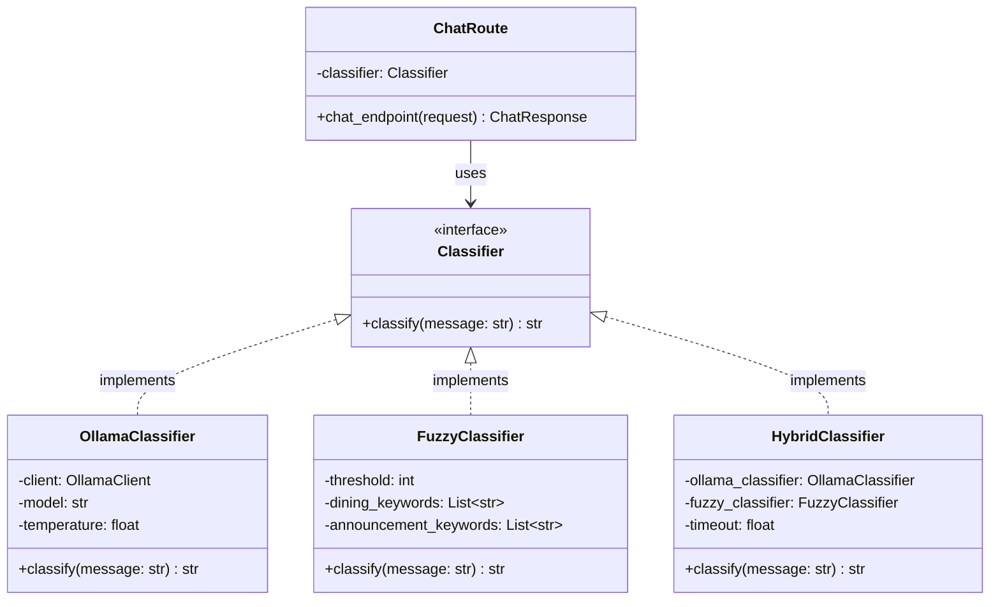
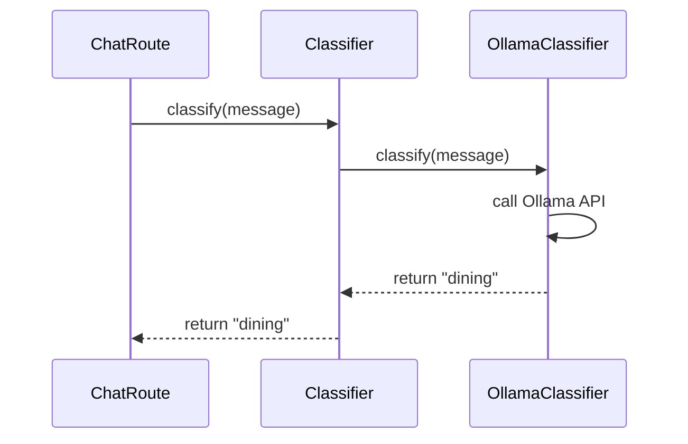

## Pattern Definition

**Strategy Pattern** is a behavioral design pattern that defines a family of algorithms, encapsulates each one, and makes them interchangeable. Strategy lets the algorithm vary independently from clients that use it.

<Info>
**Gang of Four Definition:** "Define a family of algorithms, encapsulate each one, and make them interchangeable. Strategy lets the algorithm vary independently from clients that use it."
</Info>

## Problem Statement

How do we support multiple intent classification algorithms (Ollama, Fuzzy, Hybrid) without:
- Hard-coding algorithm selection in the client code
- Creating if/else chains for each algorithm
- Making it difficult to add new algorithms

## Solution: Strategy Pattern

Create an **interface** (abstract class) that all classifiers implement, then let clients work with the interface instead of concrete implementations.

## UML Diagram



## Implementation

### 1. Strategy Interface

Located in `backend/app/llm_engine/classifier.py`:

```python
from abc import ABC, abstractmethod

class Classifier(ABC):
    """
    Strategy interface for intent classification.
    
    This abstract base class defines the contract that all
    concrete classifiers must implement.
    """
    
    @abstractmethod
    async def classify(self, user_message: str) -> str:
        """
        Classify the intent of a user message.
        
        Args:
            user_message: The user's input text
            
        Returns:
            One of: "dining", "announcement", or "general"
        """
        pass
```

<Tip>
Using `ABC` (Abstract Base Class) ensures that any class inheriting from `Classifier` **must** implement the `classify()` method, otherwise Python will raise a `TypeError`.
</Tip>

### 2. Concrete Strategy: Ollama

Located in `backend/app/llm_engine/classifiers/ollama_classifier.py`:

```python
from app.llm_engine.classifier import Classifier
from app.llm_engine.clients.ollama_client import OllamaClient

class OllamaClassifier(Classifier):
    """
    Strategy implementation using Ollama LLM for classification.
    
    Uses a local language model (Qwen2:7b) to intelligently
    classify user intent based on natural language understanding.
    """
    
    def __init__(
        self,
        base_url: str = "http://localhost:11434",
        model: str = "qwen2:7b",
        temperature: float = 0.3
    ):
        self.client = OllamaClient(base_url=base_url)
        self.model = model
        self.temperature = temperature
        self.logger = logging.getLogger(__name__)
    
    async def classify(self, user_message: str) -> str:
        """Implements the classification algorithm using Ollama."""
        
        # Construct classification prompt
        prompt = self._build_classification_prompt(user_message)
        
        try:
            # Call Ollama API
            response = await self.client.chat_completion(
                model=self.model,
                messages=[{"role": "user", "content": prompt}],
                temperature=self.temperature
            )
            
            # Extract and validate intent
            intent = response["message"]["content"].strip().lower()
            
            if intent in ["dining", "announcement", "general"]:
                return intent
            
            self.logger.warning(f"Ollama returned unexpected intent: {intent}")
            return "general"
            
        except Exception as e:
            self.logger.error(f"Ollama classification failed: {e}")
            raise
    
    def _build_classification_prompt(self, message: str) -> str:
        """Build the classification prompt for Ollama."""
        return f"""Classify this Turkish message into one of these categories:
- "dining" for food/menu questions (yemek, menü, yemekhane)
- "announcement" for announcements (duyuru, haber)
- "general" for anything else

Message: "{message}"

Respond with ONLY one word: dining, announcement, or general."""
```

**Key Characteristics:**
- 🧠 **Intelligent** - Uses NLP to understand context
- 🇹🇷 **Turkish-aware** - Native Turkish understanding
- 🔒 **Private** - Runs locally, no external API calls
- ⚡ **Async** - Non-blocking I/O for better performance

### 3. Concrete Strategy: Fuzzy

Located in `backend/app/llm_engine/classifiers/fuzzy_classifier.py`:

```python
from app.llm_engine.classifier import Classifier
from fuzzywuzzy import fuzz

class FuzzyClassifier(Classifier):
    """
    Strategy implementation using fuzzy string matching.
    
    Uses keyword lists and fuzzy string matching to classify
    intent based on similarity scores.
    """
    
    def __init__(self, threshold: int = 70):
        self.threshold = threshold
        
        # Define keyword lists for each intent
        self.dining_keywords = [
            "yemek", "menü", "yemekhane", "öğle yemeği",
            "akşam yemeği", "çorba", "yemekler", "ne yiyeceğiz",
            "bugün ne var", "yarın ne var"
        ]
        
        self.announcement_keywords = [
            "duyuru", "haber", "ilan", "duyurular",
            "haberler", "bilgi", "açıklama", "son duyurular"
        ]
    
    async def classify(self, user_message: str) -> str:
        """Implements the classification algorithm using fuzzy matching."""
        
        message_lower = user_message.lower()
        
        # Calculate maximum similarity score for each intent
        dining_score = max(
            fuzz.partial_ratio(message_lower, keyword)
            for keyword in self.dining_keywords
        )
        
        announcement_score = max(
            fuzz.partial_ratio(message_lower, keyword)
            for keyword in self.announcement_keywords
        )
        
        # Return intent with highest score above threshold
        if dining_score > self.threshold and dining_score > announcement_score:
            return "dining"
        elif announcement_score > self.threshold:
            return "announcement"
        else:
            return "general"
```

**Key Characteristics:**
- ⚡ **Fast** - Less than 10ms classification time
- 🪶 **Lightweight** - No external dependencies
- 📏 **Predictable** - Deterministic results
- 🔧 **Simple** - Easy to understand and debug

### 4. Concrete Strategy: Hybrid

Located in `backend/app/llm_engine/classifiers/hybrid_classifier.py`:

```python
from app.llm_engine.classifier import Classifier
from app.llm_engine.classifiers.ollama_classifier import OllamaClassifier
from app.llm_engine.classifiers.fuzzy_classifier import FuzzyClassifier
import asyncio

class HybridClassifier(Classifier):
    """
    Strategy implementation combining Ollama with fuzzy fallback.
    
    Attempts to use Ollama for intelligent classification,
    but falls back to fuzzy matching if Ollama fails or times out.
    """
    
    def __init__(
        self,
        ollama_base_url: str = "http://localhost:11434",
        ollama_model: str = "qwen2:7b",
        fuzzy_threshold: int = 70,
        ollama_timeout: float = 2.0
    ):
        # Compose two strategies
        self.ollama_classifier = OllamaClassifier(
            base_url=ollama_base_url,
            model=ollama_model
        )
        self.fuzzy_classifier = FuzzyClassifier(threshold=fuzzy_threshold)
        self.timeout = ollama_timeout
        self.logger = logging.getLogger(__name__)
    
    async def classify(self, user_message: str) -> str:
        """Implements hybrid classification with fallback."""
        
        try:
            # Try Ollama with timeout
            result = await asyncio.wait_for(
                self.ollama_classifier.classify(user_message),
                timeout=self.timeout
            )
            self.logger.info("Classification via Ollama")
            return result
            
        except asyncio.TimeoutError:
            self.logger.warning("Ollama timeout, falling back to fuzzy")
            return await self.fuzzy_classifier.classify(user_message)
            
        except Exception as e:
            self.logger.error(f"Ollama error: {e}, falling back to fuzzy")
            return await self.fuzzy_classifier.classify(user_message)
```

**Key Characteristics:**
- 🛡️ **Reliable** - Always returns a result
- 🏎️ **Fast fallback** - Degrades gracefully under load
- 📊 **Best of both** - Intelligent when possible, fast when needed
- 🔄 **Production-ready** - Handles failures gracefully

### 5. Context (Client)

Located in `backend/app/api/routes/chat.py`:

```python
from app.llm_engine.classifier import get_classifier_instance
from app.core.config import settings

# Get classifier instance based on configuration
classifier = get_classifier_instance(settings)

@router.post("/", response_model=ChatResponse)
async def chat_endpoint(request: ChatRequest) -> ChatResponse:
    """
    Main chat endpoint that uses the Strategy pattern.
    
    The classifier is chosen at runtime based on configuration,
    but the code here doesn't care which implementation is used.
    """
    
    # Use the classifier without knowing its concrete type
    intent = await classifier.classify(request.message)
    
    # Fetch context based on classified intent
    if intent == "dining":
        context_data = await _fetch_dining_context()
    elif intent == "announcement":
        context_data = await _fetch_announcements_context()
    else:
        context_data = "General conversation context."
    
    # Generate response
    reply = await generate_response(
        system_instruction=SYSTEM_INSTRUCTION,
        user_query=request.message,
        context_data=context_data
    )
    
    return ChatResponse(reply=reply, source=intent)
```

## Benefits Demonstrated

### 1. Open/Closed Principle
**Open for extension, closed for modification.**

To add a new classifier:
```python
# Create new classifier (NEW FILE)
class TransformerClassifier(Classifier):
    async def classify(self, user_message: str) -> str:
        # Use HuggingFace Transformers
        pass

# Update factory (MINOR CHANGE in classifier.py)
def get_classifier_instance(settings: Settings) -> Classifier:
    if settings.CLASSIFICATION_METHOD == "transformer":
        return TransformerClassifier()
    # ... rest unchanged

# Routes and other code: NO CHANGES NEEDED ✅
```

### 2. Runtime Algorithm Selection

Change classifier by editing `.env`:
```env
# Use Ollama
CLASSIFICATION_METHOD=ollama

# Use Fuzzy
CLASSIFICATION_METHOD=fuzzy

# Use Hybrid (recommended)
CLASSIFICATION_METHOD=hybrid
```

**No code changes required!**

### 3. Testability

Easy to mock the strategy for testing:

```python
class MockClassifier(Classifier):
    async def classify(self, user_message: str) -> str:
        return "dining"  # Predictable for tests

@pytest.mark.asyncio
async def test_chat_endpoint_with_dining_intent(client):
    # Inject mock classifier
    app.dependency_overrides[get_classifier_instance] = lambda: MockClassifier()
    
    response = client.post("/api/chat/", json={"message": "Test"})
    
    assert response.status_code == 200
    assert "dining" in response.json()["source"]
```

### 4. Performance Comparison

Easy to benchmark different strategies:

```python
import time

strategies = [
    OllamaClassifier(),
    FuzzyClassifier(),
    HybridClassifier()
]

test_messages = [
    "Bugün yemekte ne var?",
    "Yeni duyurular var mı?",
    "Merhaba nasılsın?"
]

for strategy in strategies:
    print(f"\nTesting {strategy.__class__.__name__}:")
    
    for message in test_messages:
        start = time.time()
        intent = await strategy.classify(message)
        duration = (time.time() - start) * 1000
        
        print(f"  {message[:30]:30} → {intent:12} ({duration:.1f}ms)")
```

**Output:**
```
Testing OllamaClassifier:
  Bugün yemekte ne var?          → dining      (245.3ms)
  Yeni duyurular var mı?         → announcement (198.7ms)
  Merhaba nasılsın?              → general     (203.1ms)

Testing FuzzyClassifier:
  Bugün yemekte ne var?          → dining      (2.1ms)
  Yeni duyurular var mı?         → announcement (1.8ms)
  Merhaba nasılsın?              → general     (1.9ms)

Testing HybridClassifier:
  Bugün yemekte ne var?          → dining      (251.2ms)
  Yeni duyurular var mı?         → announcement (204.5ms)
  Merhaba nasılsın?              → general     (3.1ms) ← fallback
```

## Pattern Structure

### Participants

1. **Strategy (`Classifier`)** - Declares interface common to all algorithms
2. **ConcreteStrategy (`OllamaClassifier`, `FuzzyClassifier`, `HybridClassifier`)** - Implements algorithm using Strategy interface
3. **Context (`chat_endpoint`)** - Uses Strategy reference to call algorithm

### Relationships



## Real-World Analogy

Think of **payment methods** in an e-commerce app:

```python
# Strategy interface
class PaymentStrategy(ABC):
    @abstractmethod
    def pay(self, amount: float) -> bool:
        pass

# Concrete strategies
class CreditCardPayment(PaymentStrategy):
    def pay(self, amount: float) -> bool:
        # Process credit card payment
        pass

class PayPalPayment(PaymentStrategy):
    def pay(self, amount: float) -> bool:
        # Process PayPal payment
        pass

class CryptoPayment(PaymentStrategy):
    def pay(self, amount: float) -> bool:
        # Process crypto payment
        pass

# Context
class ShoppingCart:
    def checkout(self, payment_method: PaymentStrategy):
        # Cart doesn't care HOW payment happens
        success = payment_method.pay(self.total)
        return success
```

Same concept applies to our classifiers - the route doesn't care **how** classification happens, just that it returns an intent.

## Common Mistakes

<Warning>
**Don't** create unnecessary strategies:
</Warning>

```python
# ❌ BAD: Strategy for trivial differences
class DiningWithEmojisClassifier(Classifier):
    async def classify(self, message: str) -> str:
        return "🍽️ dining"  # Just adds emoji - not a real algorithm change

# ✅ GOOD: Add emoji in response generation, not classification
```

<Warning>
**Don't** bypass the interface:
</Warning>

```python
# ❌ BAD: Directly using concrete class
classifier = OllamaClassifier()

# ✅ GOOD: Use interface and factory
classifier: Classifier = get_classifier_instance(settings)
```

## Next Steps

<CardGroup cols={2}>
  <Card title="Factory Pattern" icon="industry" href="/patterns/factory">
    Learn how classifiers are instantiated
  </Card>
  <Card title="Singleton Pattern" icon="crown" href="/patterns/singleton">
    Explore database connection management
  </Card>
  <Card title="LLM Engine" icon="brain" href="/backend/llm-engine">
    See Strategy pattern in production use
  </Card>
  <Card title="Testing Strategies" icon="flask" href="/backend/testing">
    Write tests for each strategy
  </Card>
</CardGroup>
