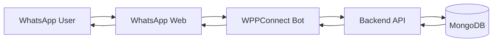

## Introduction

The **WhatsApp Bot** enables students to interact with the AI assistant directly through **WhatsApp**, the most popular messaging platform in Turkey.

Built with **WPPConnect** (a WhatsApp Web automation library), it provides:
- 💬 Natural conversation through WhatsApp
- 🔔 Automated responses 24/7
- 👥 Support for mentions in groups
- 📱 No app installation required
- 🌐 Works on any device with WhatsApp

## Architecture



## Technology Stack

<CardGroup cols={2}>
  <Card title="WPPConnect" icon="message">
    WhatsApp Web automation library
  </Card>
  <Card title="Node.js" icon="node-js">
    JavaScript runtime
  </Card>
  <Card title="Puppeteer" icon="chrome">
    Headless browser control
  </Card>
  <Card title="Axios" icon="network-wired">
    HTTP client for API calls
  </Card>
</CardGroup>

## Project Structure

```
whatsapp-bot/
├── package.json           # Dependencies
├── .env                   # Configuration
├── bot.js                 # Main bot logic
├── session/              # WhatsApp session data
└── logs/                 # Bot logs
```

## Core Implementation

### bot.js

```javascript
const wppconnect = require('@wppconnect-team/wppconnect');
const axios = require('axios');
require('dotenv').config();

const BACKEND_API_URL = process.env.BACKEND_API_URL || 'http://localhost:8000';
const BOT_NAME = process.env.BOT_NAME || 'Akdeniz CSE Bot';

async function startBot() {
  const client = await wppconnect.create({
    session: 'akdeniz-cse-bot',
    catchQR: (base64Qr, asciiQR) => {
      console.log('QR Code:', asciiQR);
      // QR code can be displayed in terminal or saved as image
    },
    statusFind: (statusSession, session) => {
      console.log('Status:', statusSession);
      console.log('Session:', session);
    },
    headless: true, // Run without browser UI
    useChrome: true,
    logQR: true
  });

  console.log(`✅ ${BOT_NAME} is ready!`);

  // Listen for incoming messages
  client.onMessage(async (message) => {
    try {
      await handleMessage(client, message);
    } catch (error) {
      console.error('Error handling message:', error);
    }
  });
}

async function handleMessage(client, message) {
  // Ignore messages from self
  if (message.isGroupMsg && message.author === message.to) return;
  
  // Check if bot is mentioned in group
  const isMention = message.mentionedJidList?.includes(
    client.getWid()._serialized
  );
  
  // Only respond to:
  // 1. Direct messages (not in group)
  // 2. Messages that mention the bot in groups
  if (message.isGroupMsg && !isMention) return;

  // Extract message text
  let userMessage = message.body;
  
  // Remove mention from message if present
  if (isMention) {
    userMessage = userMessage.replace(/@\d+/g, '').trim();
  }

  // Show typing indicator
  await client.startTyping(message.from);

  try {
    // Call backend API
    const response = await axios.post(`${BACKEND_API_URL}/api/chat/`, {
      message: userMessage,
      user_id: message.from
    });

    const reply = response.data.reply;

    // Send reply
    await client.sendText(message.from, reply);

  } catch (error) {
    console.error('API Error:', error);
    
    // Send error message
    await client.sendText(
      message.from,
      '❌ Üzgünüm, şu anda bir hata oluştu. Lütfen daha sonra tekrar deneyin.'
    );
  } finally {
    // Stop typing indicator
    await client.stopTyping(message.from);
  }
}

// Start the bot
startBot().catch(error => {
  console.error('Failed to start bot:', error);
  process.exit(1);
});
```

## Setup & Installation

<Steps>
  <Step title="Install Dependencies">
    ```bash
    cd whatsapp-bot
    npm install
    ```
  </Step>
  
  <Step title="Configure Environment">
    ```env
    # .env
    BACKEND_API_URL=http://localhost:8000
    BOT_NAME=Akdeniz CSE Bot
    SESSION_PATH=./session
    ```
  </Step>
  
  <Step title="Start Bot">
    ```bash
    npm start
    ```
  </Step>
  
  <Step title="Scan QR Code">
    1. Open WhatsApp on your phone
    2. Go to Settings → Linked Devices
    3. Scan the QR code shown in terminal
    4. Bot is now connected!
  </Step>
</Steps>

## Features

### 1. Direct Messages

User sends message directly to bot number:

```
User:  Bugün yemekte ne var?
Bot:   🍽️ Bugünkü Menü:
       • Mercimek Çorbası
       • Tavuk Şinitzel
       • Pilav
```

### 2. Group Mentions

Bot responds only when mentioned in groups:

```
User:  @AkdenizBot Yeni duyurular var mı?
Bot:   📢 Son Duyurular:
       1. Final sınav tarihleri açıklandı
       2. Mezuniyet töreni 30 Haziran'da
```

### 3. Typing Indicator

Bot shows typing indicator while processing:

```
User:  Merhaba
       [Bot is typing...]
Bot:   Merhaba! Size nasıl yardımcı olabilirim?
```

### 4. Error Handling

Graceful error messages if backend fails:

```
User:  Test message
Bot:   ❌ Üzgünüm, şu anda bir hata oluştu. 
       Lütfen daha sonra tekrar deneyin.
```

## Session Management

WPPConnect saves session data to avoid re-scanning QR code:

```javascript
const client = await wppconnect.create({
  session: 'akdeniz-cse-bot',
  sessionPath: './session', // Session files stored here
  autoClose: 60000, // Auto-close after 60 seconds of inactivity
  puppeteerOptions: {
    args: ['--no-sandbox', '--disable-setuid-sandbox']
  }
});
```

**Session files:**
```
session/
└── akdeniz-cse-bot/
    ├── Default/
    └── session.data.json  # Contains authentication tokens
```

<Warning>
**Important:** Keep `session/` folder secure and backed up. If deleted, you'll need to scan QR code again.
</Warning>

## Production Deployment

### Using PM2 (Process Manager)

```bash
# Install PM2
npm install -g pm2

# Start bot with PM2
pm2 start bot.js --name "akdeniz-whatsapp-bot"

# Auto-restart on server reboot
pm2 startup
pm2 save

# View logs
pm2 logs akdeniz-whatsapp-bot

# Monitor
pm2 monit
```

### Docker Deployment

```dockerfile
FROM node:18

WORKDIR /app

# Install Chromium dependencies
RUN apt-get update && apt-get install -y \
    chromium \
    fonts-liberation \
    libnss3 \
    libxss1 \
    libasound2

# Copy package files
COPY package*.json ./
RUN npm install

# Copy bot code
COPY . .

# Expose no ports (bot doesn't serve HTTP)
# Start bot
CMD ["node", "bot.js"]
```

```bash
# Build and run
docker build -t whatsapp-bot .
docker run -d \
  --name akdeniz-whatsapp-bot \
  -v $(pwd)/session:/app/session \
  -e BACKEND_API_URL=https://your-backend.com \
  whatsapp-bot
```

## Advanced Features

### 1. Command System

```javascript
const commands = {
  '/menu': async (client, message) => {
    const today = new Date().toISOString().split('T')[0];
    const menu = await axios.get(`${BACKEND_API_URL}/api/dining/${today}`);
    await client.sendText(message.from, formatMenu(menu.data));
  },
  
  '/duyuru': async (client, message) => {
    const announcements = await axios.get(`${BACKEND_API_URL}/api/announcements/`);
    await client.sendText(message.from, formatAnnouncements(announcements.data));
  },
  
  '/help': async (client, message) => {
    const helpText = `
🤖 Akdeniz CSE Bot Komutları:

/menu - Bugünün menüsünü gösterir
/duyuru - Son duyuruları gösterir
/help - Bu yardım mesajını gösterir

Veya doğal dilde yazabilirsiniz:
"Bugün yemekte ne var?"
"Yeni duyurular var mı?"
    `.trim();
    
    await client.sendText(message.from, helpText);
  }
};

async function handleMessage(client, message) {
  // ... existing code ...
  
  // Check for commands
  if (userMessage.startsWith('/')) {
    const [command] = userMessage.split(' ');
    if (commands[command]) {
      await commands[command](client, message);
      return;
    }
  }
  
  // Regular message handling
  // ... existing code ...
}
```

### 2. Media Support

```javascript
// Send image with caption
await client.sendImage(
  message.from,
  'path/to/menu.jpg',
  'menu-image',
  '🍽️ Bugünün Menüsü'
);

// Send file
await client.sendFile(
  message.from,
  'path/to/document.pdf',
  'announcement.pdf',
  'Final Sınav Duyurusu'
);
```

### 3. Group Management

```javascript
// Get group members
const members = await client.getGroupMembers(groupId);

// Send to specific group
await client.sendText(
  'group-id@g.us',
  '📢 Yeni duyuru: Final sınav tarihleri açıklandı!'
);

// Only allow admin commands
async function isAdmin(client, groupId, userId) {
  const group = await client.getGroupInfoFromInviteLink(groupId);
  return group.participants.some(
    p => p.id === userId && p.isAdmin
  );
}
```

## Monitoring & Logging

### Custom Logger

```javascript
const winston = require('winston');

const logger = winston.createLogger({
  level: 'info',
  format: winston.format.combine(
    winston.format.timestamp(),
    winston.format.json()
  ),
  transports: [
    new winston.transports.File({ filename: 'logs/error.log', level: 'error' }),
    new winston.transports.File({ filename: 'logs/combined.log' }),
    new winston.transports.Console({ format: winston.format.simple() })
  ]
});

// Usage
logger.info('Bot started');
logger.error('Failed to send message', { error: err.message });
```

### Health Check Endpoint

```javascript
const express = require('express');
const app = express();

let botStatus = 'initializing';

app.get('/health', (req, res) => {
  res.json({
    status: botStatus,
    uptime: process.uptime(),
    timestamp: new Date().toISOString()
  });
});

app.listen(3000, () => {
  console.log('Health check endpoint: http://localhost:3000/health');
});

// Update status
client.onStateChange((state) => {
  botStatus = state;
  logger.info('Bot state changed:', state);
});
```

## Troubleshooting

<AccordionGroup>
  <Accordion title="Bot disconnects frequently">
    **Cause:** Session expired or connection issue
    
    **Solution:**
    - Ensure stable internet connection
    - Keep server running continuously
    - Use PM2 to auto-restart on crash
    ```bash
    pm2 start bot.js --restart-delay=3000
    ```
  </Accordion>

  <Accordion title="QR code not appearing">
    **Cause:** Headless mode or display issue
    
    **Solution:**
    - Set `headless: false` for debugging
    - Check terminal for ASCII QR code
    - Or save QR as image:
    ```javascript
    catchQR: (base64Qr) => {
      const fs = require('fs');
      fs.writeFileSync('qr.png', base64Qr, 'base64');
      console.log('QR saved to qr.png');
    }
    ```
  </Accordion>

  <Accordion title="Rate limiting from WhatsApp">
    **Cause:** Sending too many messages
    
    **Solution:**
    - Add delay between messages
    ```javascript
    await delay(1000); // Wait 1 second
    await client.sendText(to, message);
    ```
    - Limit responses per user:
    ```javascript
    const rateLimiter = new Map();
    
    function checkRateLimit(userId) {
      const lastMessage = rateLimiter.get(userId) || 0;
      const now = Date.now();
      
      if (now - lastMessage < 3000) {
        return false; // Too soon
      }
      
      rateLimiter.set(userId, now);
      return true;
    }
    ```
  </Accordion>
</AccordionGroup>

## Performance Considerations

| Metric | Value |
|--------|-------|
| **Response Time** | 1-3 seconds (depends on backend) |
| **Max Throughput** | ~30 messages/minute (WhatsApp limit) |
| **Memory Usage** | ~200-300MB (Chromium overhead) |
| **CPU Usage** | ~5-10% (idle), ~20-30% (active) |

<Tip>
For high-volume scenarios, consider using **WhatsApp Business API** (official, paid) instead of WPPConnect.
</Tip>

## Limitations

<Warning>
**WPPConnect Limitations:**
</Warning>

1. **Against WhatsApp ToS** - Automation may violate terms of service
2. **Account Ban Risk** - WhatsApp may ban the number
3. **Not Official API** - No SLA or support
4. **Requires Browser** - Chromium must be running
5. **Session Management** - Must handle disconnections

**For production, consider:**
- WhatsApp Business API (official, paid)
- Twilio WhatsApp Integration
- MessageBird WhatsApp

## Next Steps

<CardGroup cols={2}>
  <Card title="Setup Guide" icon="wrench" href="/whatsapp/setup">
    Detailed setup instructions
  </Card>
  <Card title="Integration" icon="plug" href="/whatsapp/integration">
    Integrate with backend
  </Card>
  <Card title="Deployment" icon="rocket" href="/deployment/overview">
    Deploy to production
  </Card>
  <Card title="Backend API" icon="server" href="/backend/overview">
    Understand backend architecture
  </Card>
</CardGroup>
